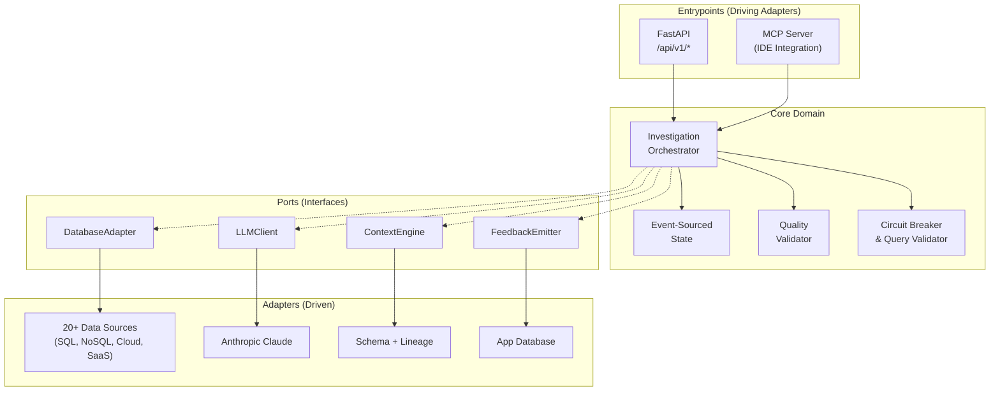
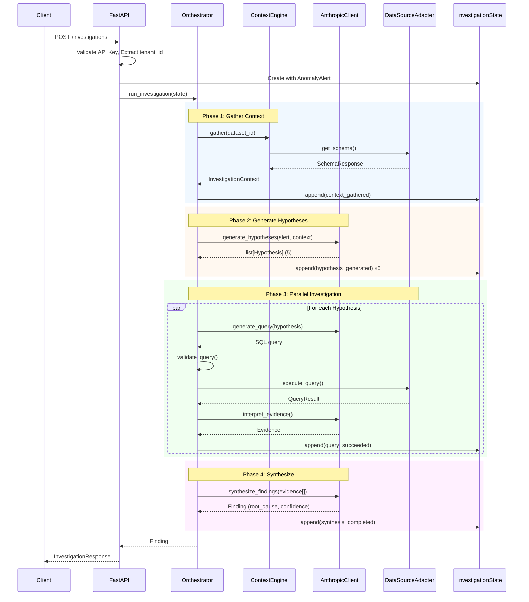
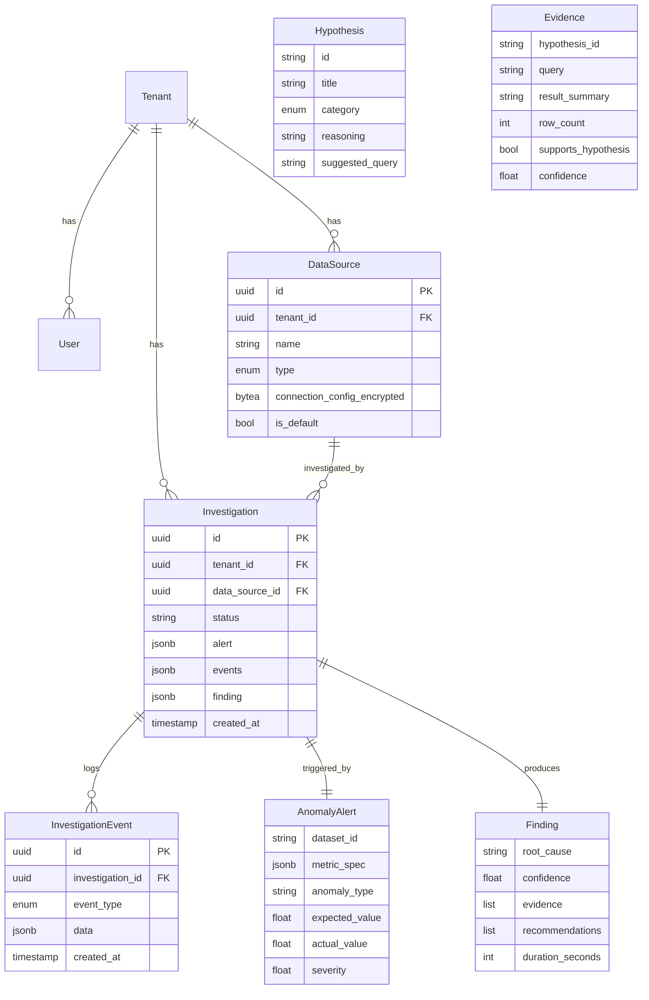

# Dataing Architecture

## Executive Summary

**Dataing** is an autonomous data quality investigation platform that automatically diagnoses why data anomalies occurred. When traditional monitoring tools detect an issue (e.g., "NULL rate spiked to 15%"), Dataing investigates the root cause by gathering context, generating hypotheses, testing them via SQL queries in parallel, and synthesizing findings into actionable recommendations.

The system uses a **hexagonal architecture** with event-sourced state, enabling clean separation between domain logic and external systems (databases, LLMs, APIs). This design supports 20+ data source types through a unified adapter pattern, making the core investigation logic data-source agnostic.

---

## High-Level Architecture

Dataing follows the **Hexagonal Architecture** (Ports & Adapters) pattern. The core domain contains pure business logic that depends only on protocol interfaces, while adapters handle all external I/O (databases, LLMs, APIs).



### Key Architectural Decisions

| Decision | Rationale |
|----------|-----------|
| **Hexagonal Architecture** | Core domain has zero infrastructure coupling; adapters can be swapped without touching business logic |
| **Event Sourcing** | Complete audit trail; state derived from immutable events; enables replay and debugging |
| **Protocol-based Interfaces** | Python `Protocol` classes define contracts; implementations are injected at runtime |
| **Parallel Investigation** | Hypotheses tested concurrently via asyncio; no hypothesis blocks another |
| **LLM-as-Judge Quality** | Validates output quality with dimensional scoring; captures training signals for RL |

---

## Project Structure

```
backend/src/dataing/
├── core/                    # Domain Logic (no external dependencies)
│   ├── orchestrator.py      # Main investigation workflow
│   ├── domain_types.py      # AnomalyAlert, Hypothesis, Evidence, Finding
│   ├── interfaces.py        # Protocol definitions (ports)
│   ├── state.py             # Event-sourced InvestigationState
│   ├── exceptions.py        # Domain-specific errors
│   ├── quality/             # LLM output quality validation
│   │   ├── protocol.py      # QualityValidator interface
│   │   ├── assessment.py    # QualityAssessment, HypothesisSetAssessment
│   │   └── judge.py         # LLM-as-judge implementation
│   └── safety/              # Safety guardrails
│       ├── circuit_breaker.py
│       ├── validator.py     # SQL query validation
│       └── pii.py           # PII detection

├── adapters/                # External System Integrations
│   ├── datasource/          # 20+ data source adapters
│   │   ├── base.py          # BaseAdapter, SQLAdapter ABCs
│   │   ├── registry.py      # Dynamic adapter creation
│   │   ├── types.py         # SchemaResponse, QueryResult, NormalizedType
│   │   ├── sql/             # PostgreSQL, Snowflake, BigQuery, etc.
│   │   ├── document/        # MongoDB, DynamoDB, Cassandra
│   │   ├── api/             # Salesforce, HubSpot, Stripe
│   │   └── filesystem/      # S3, GCS, HDFS
│   ├── llm/                 # LLM client (Anthropic)
│   │   ├── client.py        # AnthropicClient with Pydantic AI
│   │   └── response_models.py
│   ├── context/             # Context gathering
│   │   ├── engine.py        # ContextEngine orchestrator
│   │   ├── schema.py        # Schema discovery
│   │   └── lineage.py       # Lineage client
│   ├── db/                  # Application database
│   │   └── app_db.py        # asyncpg PostgreSQL
│   ├── auth/                # Authentication
│   ├── rbac/                # Role-based access control
│   ├── audit/               # Request/response logging
│   └── notifications/       # Slack, email, webhooks

├── entrypoints/             # External Interfaces
│   ├── api/                 # FastAPI application
│   │   ├── app.py           # Application factory
│   │   ├── routes/          # API endpoints
│   │   ├── middleware/      # Auth, rate limiting, audit
│   │   └── deps.py          # Dependency injection
│   └── mcp/                 # Model Context Protocol server
│       └── server.py

└── models/                  # SQLAlchemy ORM models

frontend/                    # React + TypeScript + Vite
├── src/
│   ├── features/            # Feature-based organization
│   │   ├── dashboard/
│   │   ├── investigations/
│   │   ├── datasources/
│   │   └── settings/
│   ├── components/ui/       # shadcn/ui components
│   ├── lib/api/             # Generated API client (orval)
│   └── lib/auth/            # Auth context
```

---

## Core Data Flows

### The Life of an Investigation

This is the primary workflow: an anomaly alert triggers an autonomous investigation that produces a root cause finding.



### Investigation Flow Details

1. **Context Gathering** (Fail-Fast)
   - Schema discovery is **required** - investigation fails immediately if empty
   - Lineage is **optional** - enhances hypotheses but not critical
   - Context converted to LLM-friendly prompt format

2. **Hypothesis Generation**
   - LLM generates 5 potential root causes across categories:
     - `UPSTREAM_DEPENDENCY` - Issues in source tables/pipelines
     - `TRANSFORMATION_BUG` - Logic errors in ETL
     - `DATA_QUALITY` - Source data problems
     - `INFRASTRUCTURE` - System/connectivity failures
     - `EXPECTED_VARIANCE` - Normal business fluctuation

3. **Parallel Investigation**
   - All hypotheses investigated concurrently via `asyncio.gather()`
   - Each hypothesis gets up to 3 queries with 2 retry attempts
   - **Reflexion loop**: Failed queries are retried with error context
   - **Circuit breaker** enforces limits (50 total queries, 10-minute timeout)
   - **Early stopping**: If confidence > 0.85, stop investigating that hypothesis

4. **Synthesis**
   - LLM combines all evidence into a single root cause
   - Returns: `root_cause`, `confidence`, `recommendations[]`
   - Quality validator scores output on causal_depth, specificity, actionability

---

## Key Technical Decisions & Patterns

### Event-Sourced State

Investigation state is derived entirely from an immutable event log:

```python
@dataclass(frozen=True)
class InvestigationState:
    id: str
    tenant_id: str
    alert: AnomalyAlert
    events: tuple[InvestigationEvent, ...]  # Immutable tuple

    @property
    def status(self) -> InvestigationStatus:
        """Status computed from last event type"""
        return self.events[-1].type.to_status()

    def get_retry_count(self, hypothesis_id: str) -> int:
        """Count derived from events, not stored"""
        return sum(1 for e in self.events
                   if e.type == "reflexion_attempted"
                   and e.data.get("hypothesis_id") == hypothesis_id)

    def append_event(self, event: InvestigationEvent) -> "InvestigationState":
        """Returns new state with event appended (immutable)"""
        return replace(self, events=self.events + (event,))
```

**Benefits:**
- Complete audit trail of every action
- No mutable counters that can desync
- Enables replay for debugging
- Natural fit for streaming updates to frontend

### Circuit Breaker Pattern

Prevents runaway investigations from consuming resources:

```python
@dataclass
class CircuitBreakerConfig:
    max_total_queries: int = 50        # All hypotheses combined
    max_queries_per_hypothesis: int = 5
    max_retries_per_hypothesis: int = 2
    max_consecutive_failures: int = 3  # Stall detection
    max_duration_seconds: int = 600    # 10 minutes
```

**Safety checks:**
- Total query limit across all hypotheses
- Per-hypothesis query and retry limits
- Consecutive failure detection (indicates stalled investigation)
- Duplicate query detection (prevents infinite loops)
- Wall-clock timeout

### Query Validation

Multi-layer SQL validation using `sqlglot` AST parsing:

```python
def validate_query(sql: str) -> ValidationResult:
    # 1. Parse with sqlglot (proper AST, not regex)
    parsed = sqlglot.parse_one(sql)

    # 2. Enforce SELECT-only
    if parsed.key != "select":
        raise QueryValidationError("Only SELECT statements allowed")

    # 3. Block forbidden statements (DELETE, DROP, etc.)
    forbidden = {"DELETE", "DROP", "TRUNCATE", "UPDATE", "INSERT", ...}
    if any(kw in sql.upper() for kw in forbidden):
        raise QueryValidationError(f"Forbidden keyword detected")

    # 4. Require LIMIT clause
    if not parsed.find(exp.Limit):
        raise QueryValidationError("Query must include LIMIT clause")
```

### Quality Validation (LLM-as-Judge)

Dimensional scoring to ensure meaningful outputs:

| Dimension | Weight | What It Measures |
|-----------|--------|------------------|
| **causal_depth** | 50% | Explains WHY, not just WHAT (full causal chain) |
| **specificity** | 30% | Concrete data: timestamps, counts, table names |
| **actionability** | 20% | Specific recommendations (commands, not "investigate") |

**Composite score:** `causal_depth * 0.5 + specificity * 0.3 + actionability * 0.2`
**Pass threshold:** 0.6 (configurable)

### Adapter Registry Pattern

Dynamic adapter creation by type:

```python
class AdapterRegistry:
    _adapters: dict[SourceType, type[BaseAdapter]] = {}

    @classmethod
    def register(cls, source_type: SourceType):
        def decorator(adapter_class):
            cls._adapters[source_type] = adapter_class
            return adapter_class
        return decorator

    @classmethod
    def create(cls, source_type: SourceType, config: dict) -> BaseAdapter:
        adapter_class = cls._adapters[source_type]
        return adapter_class(**config)
```

**Usage:**
```python
@AdapterRegistry.register(SourceType.POSTGRESQL)
class PostgresAdapter(SQLAdapter):
    ...

# At runtime
adapter = AdapterRegistry.create(SourceType.POSTGRESQL, connection_config)
```

### Pydantic AI for Structured Outputs

Uses **PromptedOutput mode** for chain-of-thought before structured JSON:

```python
from pydantic_ai import Agent
from pydantic_ai.output import PromptedOutput

self._hypothesis_agent = Agent(
    self._model,
    output_type=PromptedOutput[HypothesesResponse],  # Think first, then structure
    system_prompt=HYPOTHESIS_SYSTEM_PROMPT,
)
```

**Why Pydantic AI:**
- Type-safe structured outputs with Pydantic validation
- Built-in retry on validation failures
- PromptedOutput enables reasoning before answering (better quality)

---

## Data Model

### Core Domain Entities



### Event Types

| Event | Description |
|-------|-------------|
| `investigation_started` | Investigation created with alert |
| `context_gathered` | Schema/lineage retrieved |
| `schema_discovery_failed` | Fatal: empty schema |
| `hypothesis_generated` | LLM created hypothesis |
| `query_submitted` | Query sent to data source |
| `query_succeeded` | Query returned results |
| `query_failed` | Query error (timeout, syntax) |
| `reflexion_attempted` | Retry with error context |
| `hypothesis_confirmed` | Evidence supports hypothesis |
| `hypothesis_rejected` | Evidence refutes hypothesis |
| `synthesis_completed` | Root cause determined |
| `investigation_failed` | Unrecoverable error |

---

## Infrastructure & Deployment

### Dependencies

| Component | Technology | Purpose |
|-----------|------------|---------|
| **Application Database** | PostgreSQL | Tenant/user data, investigations, audit logs |
| **Data Sources** | 20+ adapters | Customer data being investigated |
| **LLM** | Anthropic Claude | Hypothesis generation, evidence interpretation |
| **Task Queue** | (TBD) | Background investigation processing |
| **Cache** | (TBD) | Schema caching, rate limiting |

### Configuration

Environment variables (`.env` or system):

```bash
# Application
ANTHROPIC_API_KEY=sk-...           # Required for LLM
DATABASE_URL=postgresql://...       # App database
LLM_MODEL=claude-sonnet-4-20250514  # Model selection

# Security
SECRET_KEY=...                      # JWT signing
ENCRYPTION_KEY=...                  # Data source credential encryption

# Feature Flags
VALIDATION_ENABLED=true             # Quality validation
VALIDATION_PASS_THRESHOLD=0.6
```

### Local Development

```bash
# Setup
just setup                 # Install all dependencies

# Run full demo stack
just demo                  # Backend + Frontend + PostgreSQL + seed data
# Frontend: http://localhost:3000
# Backend:  http://localhost:8000
# API Key:  dd_demo_12345

# Individual services
just dev-backend           # FastAPI on port 8000
just dev-frontend          # Vite on port 3000

# Testing
just test                  # All tests
just lint                  # Ruff + mypy + eslint
```

### Demo Fixtures

Pre-generated anomaly scenarios in `demo/fixtures/`:

| Fixture | Anomaly | Root Cause |
|---------|---------|------------|
| `null_spike` | NULL user_id | Mobile app v2.3.1 bug |
| `volume_drop` | Missing EU events | CDN misconfiguration |
| `schema_drift` | Price as string | ETL schema change |
| `duplicates` | Duplicate order items | Retry logic bug |
| `late_arriving` | Timestamp gaps | Batch job delay |
| `orphaned_records` | Missing FK references | Cascade delete disabled |

---

## Appendix: Supported Data Sources

| Category | Sources |
|----------|---------|
| **SQL Databases** | PostgreSQL, MySQL, Trino, Snowflake, BigQuery, Redshift, DuckDB |
| **Document Stores** | MongoDB, DynamoDB, Cassandra |
| **Cloud Storage** | S3, GCS, HDFS |
| **SaaS APIs** | Salesforce, HubSpot, Stripe |

All sources implement a unified interface returning `SchemaResponse` and `QueryResult`, making the core investigation logic completely data-source agnostic.
