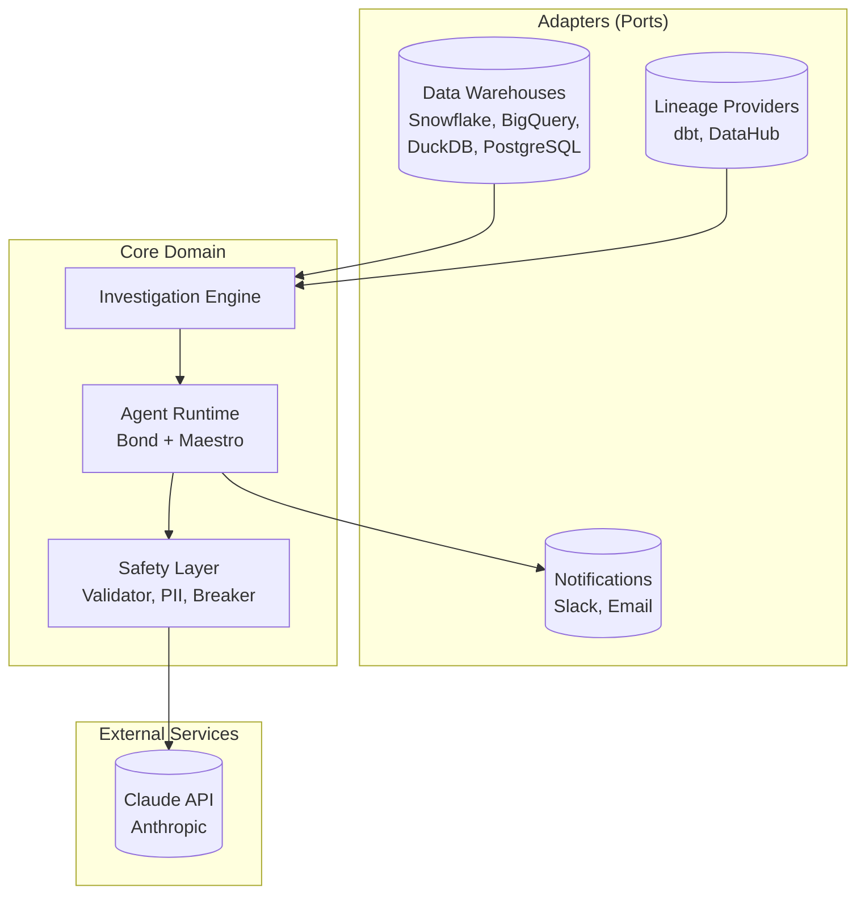
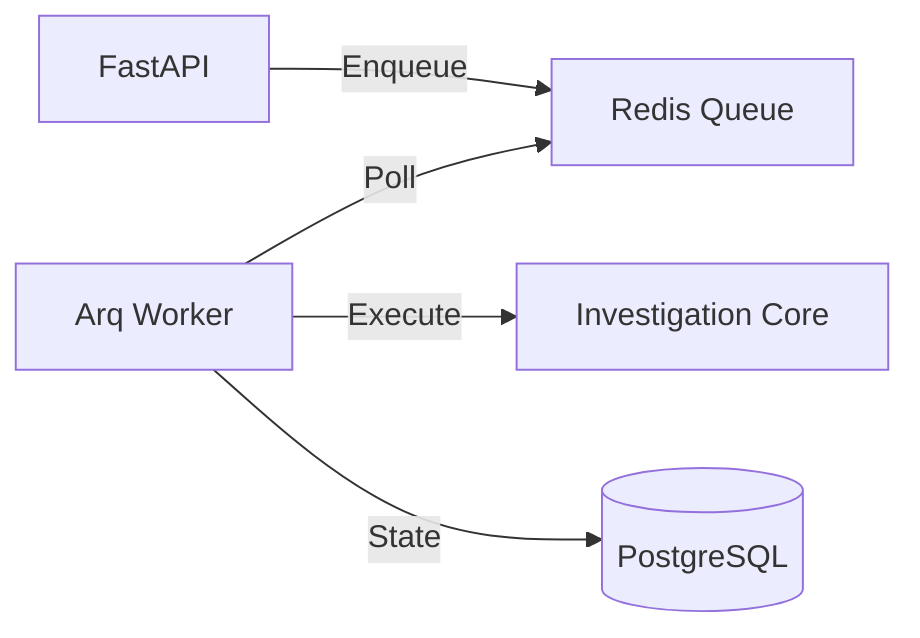
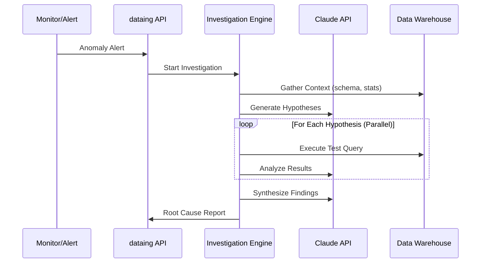

# Architecture

dataing is built on a hexagonal (ports & adapters) architecture with an agentic workflow engine. This design enables flexibility, testability, and safety.

---

## High-Level Overview



---

## Runtime Architecture

While the logical architecture is hexagonal, the runtime architecture is distributed to ensure reliable, long-running investigation execution.



| Component | Role |
|-----------|------|
| **FastAPI** | Handles HTTP requests, authentication, and enqueues investigation jobs. |
| **Redis** | Durable job queue that persists jobs until successfully processed. |
| **Arq Worker** | Background worker that executes investigation steps, handling retries and timeouts. |
| **PostgreSQL** | Stores investigation state (checkpoints), results, and history. |

This separation ensures that:

1.  **Resilience**: Worker crashes don't lose data; jobs are retried from the last checkpoint.
2.  **Scalability**: Workers can be scaled horizontally (e.g., via KEDA) based on queue depth.
3.  **Responsiveness**: API requests remain fast even for long-running investigations.

---

## Hexagonal Architecture

The hexagonal (ports & adapters) architecture separates business logic from external concerns:

### Core Domain

The core domain contains pure business logic with **no external dependencies**:

```
dataing/src/dataing/core/
├── investigation/          # Investigation workflow
│   ├── flow.py            # Workflow builder
│   ├── steps/             # Investigation steps
│   └── service.py         # Service orchestration
├── domain_types.py        # Core domain models
├── interfaces.py          # Port definitions
└── state.py               # Event-sourced state
```

**Key principles:**

- Framework-agnostic (no FastAPI, no database imports)
- Dependency injection via ports (interfaces)
- Easily testable with mock implementations

### Adapters

Adapters implement the ports defined by the core:

```
dataing/src/dataing/adapters/
├── datasource/            # Data warehouse adapters
│   ├── snowflake.py
│   ├── bigquery.py
│   ├── duckdb.py
│   └── postgres.py
├── lineage/               # Lineage provider adapters
│   ├── dbt.py
│   └── datahub.py
├── auth/                  # Authentication adapters
├── notifications/         # Notification adapters
└── db/                    # Application database
```

**Swapping adapters** is straightforward - implement the port interface:

```python
# Port (interface)
class DataSourcePort(Protocol):
    async def execute_query(self, sql: str) -> list[dict[str, Any]]:
        ...

# Adapter (implementation)
class SnowflakeAdapter:
    async def execute_query(self, sql: str) -> list[dict[str, Any]]:
        # Snowflake-specific implementation
        ...
```

---

## Package Dependency Order

dataing is organized as a monorepo with a clear dependency hierarchy:

```
maestro (zero deps)
    ↓
  bond (maestro + pydantic-ai)
    ↓
dataing (bond + maestro + adapters)
```

| Package | Purpose | Dependencies |
|---------|---------|--------------|
| **maestro** | Workflow FSM engine | None (stdlib only) |
| **bond** | Agent runtime | maestro, pydantic-ai |
| **dataing** | Investigation platform | bond, maestro, adapters |

---

## Maestro: Workflow Engine

Maestro is a generic workflow engine with **zero external dependencies**:

```
maestro/src/maestro/
├── step.py       # Step protocol
├── signals.py    # Control flow signals
├── result.py     # StepResult, BranchRequest
├── handlers.py   # Signal handlers
└── workflow.py   # Workflow executor
```

### Steps

Steps are the building blocks of workflows. They satisfy a protocol (structural typing):

```python
@runtime_checkable
class Step(Protocol[ContextT, InputT, OutputT]):
    @property
    def name(self) -> str: ...

    async def execute(
        self, context: ContextT, input_data: InputT
    ) -> StepResult[ContextT, OutputT]: ...

    def can_execute(self, context: ContextT) -> bool: ...
```

### Signals

Signals control workflow execution:

| Signal | Meaning |
|--------|---------|
| `CONTINUE` | Proceed to next step |
| `COMPLETE` | Workflow finished successfully |
| `FAIL` | Workflow failed |
| `BRANCH` | Create parallel child workflows |
| `MERGE` | Await convergence of branches |
| `AWAIT_USER` | Pause for human-in-the-loop |

### Branching

Maestro supports **parallel hypothesis testing**:

```python
# Generate hypotheses step returns BRANCH signal
StepResult(
    context=ctx,
    signal=Signal.BRANCH,
    branch_request=BranchRequest(
        branches=[
            BranchSpec(id="hyp_1", start_step="test_hypothesis"),
            BranchSpec(id="hyp_2", start_step="test_hypothesis"),
        ]
    )
)
```

Each branch executes independently, then MERGE synthesizes results.

---

## Bond: Agent Runtime

Bond wraps PydanticAI for LLM interactions with structured outputs:

```
bond/src/bond/
├── agent.py              # BondAgent
├── maestro/
│   └── bond_step.py      # BondStep template
└── memory/               # Agent memory tools
```

### BondStep Template

BondStep bridges BondAgent with maestro.Step using a template method pattern:

```python
class GenerateHypothesesStep(BondStep[Context, None, list[Hypothesis], str]):

    def create_agent(self, context):
        return BondAgent(
            name="hypothesis_generator",
            model="anthropic:claude-sonnet-4-20250514",
        )

    def build_prompt(self, context, input_data):
        return f"Generate hypotheses for: {context.alert}"

    def map_response(self, response, context):
        hypotheses = parse(response)
        return StepResult(context=ctx, signal=Signal.BRANCH, ...)
```

**Key features:**

- Streaming support for real-time updates
- Structured outputs with Pydantic validation
- Token usage tracking

---

## Safety Layer

The safety layer prevents harmful queries and runaway execution:

```
dataing/src/dataing/safety/
├── validator.py       # SQL validation with sqlglot
├── pii.py            # PII detection and redaction
└── circuit_breaker.py # Execution limits
```

### Defense in Depth

| Layer | Protection |
|-------|------------|
| **SQL Validator** | Only SELECT, LIMIT required, no forbidden keywords |
| **PII Redactor** | Mask email, SSN, CC, phone before LLM |
| **Circuit Breaker** | Max 50 queries, 10 min timeout |

[Learn more about security](security/data-privacy.md)

---

## Investigation Data Flow



1. **Alert Received** - External monitor detects anomaly
2. **Context Gathering** - Fetch schema, column statistics, lineage
3. **Hypothesis Generation** - LLM proposes potential root causes
4. **Parallel Testing** - Each hypothesis tested with SQL (BRANCH)
5. **Synthesis** - Results merged into root cause report (MERGE)

---

## Learn More

<div class="grid cards" markdown>

-   :material-magnify: **[How Investigations Work](concepts/investigations.md)**

    ---

    Deep dive into the investigation workflow

-   :material-state-machine: **[Agent Workflows (Maestro)](concepts/agent-workflows.md)**

    ---

    Understanding the workflow engine

-   :material-shield: **[Safety & Guardrails](concepts/guardrails.md)**

    ---

    SQL validation, PII masking, circuit breakers

-   :material-connection: **[Integrations](integrations/warehouses/snowflake.md)**

    ---

    Connect to your data warehouse

</div>
