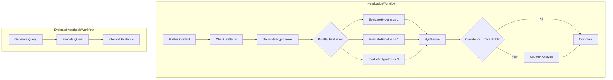

# Temporal Workflow Architecture

dataing uses [Temporal](https://temporal.io) for durable workflow execution, ensuring investigations run reliably even through failures, restarts, and network issues.

---

## Why Temporal?

| Challenge | Temporal Solution |
|-----------|-------------------|
| **Long-running investigations** | Durable execution with automatic state persistence |
| **Parallel hypothesis evaluation** | Child workflows for concurrent execution |
| **Failure recovery** | Automatic retry with configurable policies |
| **Visibility** | Web UI shows workflow history, state, and progress |
| **Cancellation** | Graceful cancellation with cleanup |

Previously, dataing used Arq with Redis for background jobs. Temporal provides stronger guarantees for the investigation use case where failures mid-execution are costly.

---

## Workflow Structure



### InvestigationWorkflow

The main orchestrator workflow that coordinates the full investigation:

1. **Gather Context** - Collect schema, lineage, and sample data
2. **Check Patterns** - Identify known anomaly patterns
3. **Generate Hypotheses** - Create hypotheses based on context
4. **Evaluate Hypotheses** - Spawn child workflows in parallel
5. **Synthesize** - Combine evidence into root cause analysis
6. **Counter-Analysis** - Challenge findings if confidence is low

### EvaluateHypothesisWorkflow

Child workflow for evaluating a single hypothesis:

1. **Generate Query** - Create SQL to test the hypothesis
2. **Execute Query** - Run against the datasource
3. **Interpret Evidence** - Analyze results, determine support/refute

Child workflows enable:
- Parallel execution (all hypotheses evaluated concurrently)
- Independent failure handling (one failure doesn't kill others)
- Better visibility (each appears in Temporal UI)

---

## Key Components

### Workflows

| File | Purpose |
|------|---------|
| `temporal/workflows/investigation.py` | Main orchestrator workflow |
| `temporal/workflows/evaluate_hypothesis.py` | Child workflow for hypothesis evaluation |

### Activities

Activities are the actual work units - LLM calls, SQL execution, etc:

| Activity | Purpose |
|----------|---------|
| `gather_context` | Collect schema, lineage, samples |
| `check_patterns` | Identify known anomaly patterns |
| `generate_hypotheses` | Create hypotheses from context |
| `generate_query` | Create SQL to test hypothesis |
| `execute_query` | Run SQL against datasource |
| `interpret_evidence` | Analyze query results |
| `synthesize` | Combine evidence into findings |
| `counter_analyze` | Challenge the synthesis |

### Client

| File | Purpose |
|------|---------|
| `temporal/client.py` | `TemporalInvestigationClient` for starting/managing workflows |

### Worker

| File | Purpose |
|------|---------|
| `entrypoints/temporal_worker.py` | Worker setup with activity factory |

---

## Activity Factory Pattern

Activities need access to adapters (database, LLM, datasource). We use a factory pattern for dependency injection:

```python
def create_activities(
    db: AppDatabase,
    agent_client: AgentClient,
    datasource_adapter: DataSourceAdapter,
) -> list[Callable]:
    """Create activity functions with injected dependencies."""

    async def gather_context(input: GatherContextInput) -> dict:
        # Use injected db, agent_client, datasource_adapter
        ...

    return [gather_context, generate_hypotheses, ...]
```

This allows:
- **Testing** - Mock adapters for unit tests
- **Configuration** - Different adapters per environment
- **Isolation** - Activities don't share global state

---

## Signals and Queries

### Signals (async messages to workflow)

| Signal | Purpose |
|--------|---------|
| `cancel_investigation` | Gracefully cancel and clean up |
| `user_input` | Provide user feedback when awaiting input |

### Queries (sync read of workflow state)

| Query | Returns |
|-------|---------|
| `get_status` | Current step, progress, evidence count |

---

## Running Locally

### 1. Start Temporal Server

```bash
# Using Temporal CLI (recommended for development)
temporal server start-dev

# Or via Docker
docker run -d --name temporal \
  -p 7233:7233 -p 8233:8233 \
  temporalio/auto-setup
```

### 2. Start the Worker

```bash
# Via just command
just dev-backend

# Or directly
uv run python -m dataing.entrypoints.temporal_worker
```

### 3. Environment Variables

```bash
TEMPORAL_HOST=localhost:7233  # Temporal server address
TEMPORAL_NAMESPACE=default     # Namespace (default for local)
TEMPORAL_TASK_QUEUE=investigations  # Task queue name
```

### 4. View Workflows

Open the Temporal Web UI at `http://localhost:8233` to see:
- Running workflows
- Workflow history
- Activity execution
- Retries and failures

---

## Configuration

### Timeouts

```python
# Activity timeouts (in investigation.py)
start_to_close_timeout=timedelta(minutes=5)  # Max activity duration
retry_policy=RetryPolicy(
    initial_interval=timedelta(seconds=1),
    maximum_attempts=3,
)
```

### Child Workflow Options

```python
# Child workflow for hypothesis evaluation
await workflow.execute_child_workflow(
    EvaluateHypothesisWorkflow.run,
    input,
    id=f"{investigation_id}-hypothesis-{i}",
    task_queue="investigations",
)
```

---

## Error Handling

### Activity Failures

Activities automatically retry on transient failures (network, timeouts). After max attempts, the workflow can:
- Continue with partial results
- Mark hypothesis as failed
- Trigger counter-analysis

### Workflow Cancellation

When `cancel_investigation` signal is received:

1. Set `_cancelled` flag
2. Cancel pending child workflows
3. Clean up any partial state
4. Return `InvestigationResult` with `status="cancelled"`

---

## Monitoring

### Metrics to Watch

- `temporal_workflow_task_execution_latency` - Workflow task latency
- `temporal_activity_execution_latency` - Activity execution time
- `temporal_workflow_failed_total` - Workflow failure count

### Alerting

Set alerts for:
- Activity retry rate > 10%
- Workflow duration > 30 minutes
- Worker task queue backlog > 100

---

## See Also

- [How Investigations Work](../concepts/investigations.md) - User-facing investigation docs
- [The Agent Engine (Maistro)](../concepts/agent-workflows.md) - Step/signal protocol
- [Temporal Documentation](https://docs.temporal.io) - Official Temporal docs
