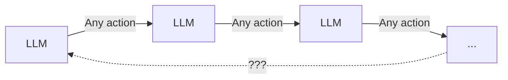
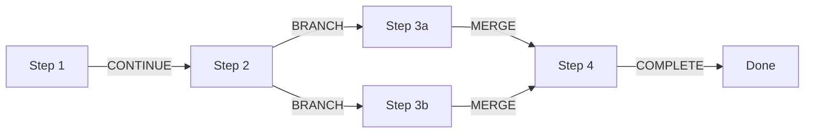
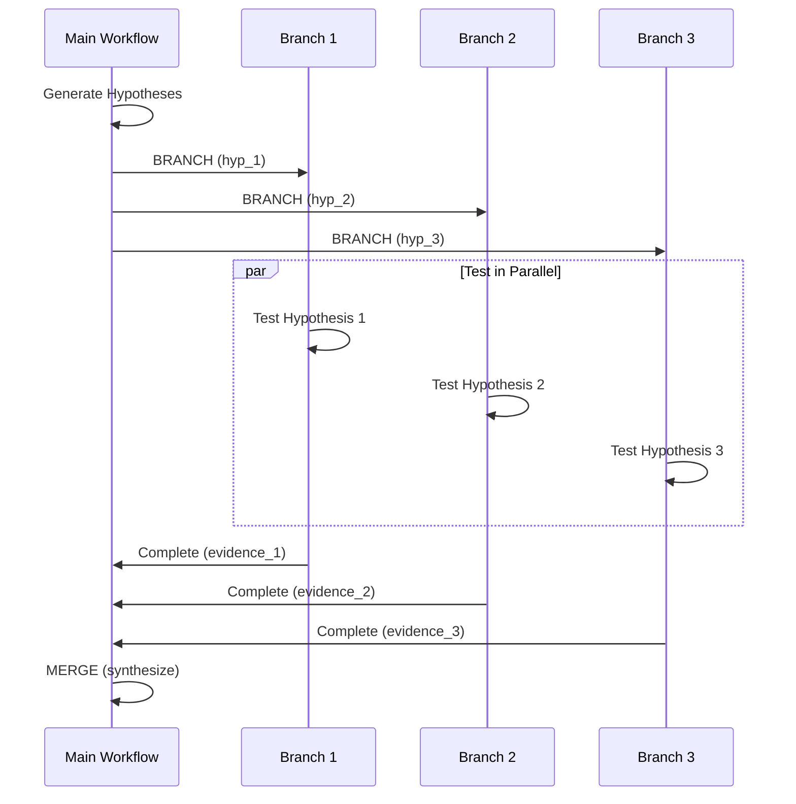

# The Agent Engine (Maestro)

Maestro is dataing's workflow engine - a finite state machine that provides deterministic execution with human-in-the-loop gates.

---

## Why a State Machine?

LLMs are powerful but unpredictable. Without structure, they can:

- **Hallucinate** - Generate plausible but incorrect information
- **Loop infinitely** - Retry failed approaches forever
- **Drift off-topic** - Explore tangential hypotheses
- **Act without permission** - Execute queries without review

Maestro solves these problems with **bounded, deterministic workflows**:

<div class="grid" markdown>

<div markdown>

**Without Maestro**



</div>

<div markdown>

**With Maestro**



</div>

</div>

!!! success "Why Maestro Wins"

    | | Without Maestro | With Maestro |
    |---|---|---|
    | **Termination** | May loop forever | Guaranteed to complete or fail |
    | **Cost Control** | Unbounded token spend | Circuit breaker limits |
    | **Auditability** | Black box decisions | Every step logged with signal |
    | **Human Oversight** | None - autonomous agent | `AWAIT_USER` gates for approval |
    | **Parallelism** | Sequential or uncoordinated | Structured `BRANCH`/`MERGE` |
    | **Error Recovery** | Undefined behavior | Explicit `FAIL` signal handling |

    **The unbounded approach** treats the LLM as an autonomous agent that can take any action at any time. This leads to runaway costs, infinite loops, and decisions made without human review.

    **Maestro's FSM approach** constrains the LLM to well-defined steps with explicit transitions. The workflow always terminates, costs are bounded, and humans can gate critical decisions.

---

## Core Concepts

### Steps

Steps are the building blocks of workflows. Each step:

- Has a **name** for identification
- **Executes** an action on a context
- Returns a **signal** for control flow
- Can **branch** into parallel workflows

```python
@runtime_checkable
class Step(Protocol[ContextT, InputT, OutputT]):
    """Protocol for workflow steps."""

    @property
    def name(self) -> str:
        """Unique step identifier."""
        ...

    async def execute(
        self, context: ContextT, input_data: InputT
    ) -> StepResult[ContextT, OutputT]:
        """Execute the step and return a result."""
        ...

    def can_execute(self, context: ContextT) -> bool:
        """Check if step can execute in current context."""
        ...
```

### Signals

Signals tell the workflow engine what to do after a step:

| Signal | Meaning | Use Case |
|--------|---------|----------|
| `CONTINUE` | Proceed to next step | Normal progression |
| `COMPLETE` | Workflow finished | Investigation complete |
| `FAIL` | Workflow failed | Error or timeout |
| `BRANCH` | Create parallel workflows | Test multiple hypotheses |
| `MERGE` | Await child branches | Synthesize results |
| `AWAIT_USER` | Pause for human input | Approval gate |

```python
class Signal(str, Enum):
    CONTINUE = "continue"
    COMPLETE = "complete"
    FAIL = "fail"
    BRANCH = "branch"
    MERGE = "merge"
    AWAIT_USER = "await_user"
```

### Step Results

Every step returns a `StepResult` with:

- **context** - Updated workflow context
- **signal** - What to do next
- **output** - Step-specific output data
- **branch_request** - (Optional) Branching instructions

```python
@dataclass(frozen=True)
class StepResult(Generic[ContextT, OutputT]):
    context: ContextT
    signal: Signal
    output: OutputT | None = None
    branch_request: BranchRequest | None = None
```

---

## Branching & Merging

Maestro's killer feature is **parallel hypothesis testing** via branching:

### Branch Request

When a step returns `Signal.BRANCH`, it specifies child workflows:

```python
StepResult(
    context=ctx,
    signal=Signal.BRANCH,
    branch_request=BranchRequest(
        branches=[
            BranchSpec(id="hyp_mobile_bug", start_step="test_hypothesis"),
            BranchSpec(id="hyp_guest_checkout", start_step="test_hypothesis"),
            BranchSpec(id="hyp_pipeline_drop", start_step="test_hypothesis"),
        ]
    )
)
```

### Execution Flow



### Merge Step

When all branches complete, the `MERGE` signal synthesizes results:

```python
class SynthesizeStep:
    async def execute(self, context, branch_results):
        # All branch results available here
        evidence = [r.evidence for r in branch_results]
        root_cause = synthesize(evidence)
        return StepResult(
            context=context.with_root_cause(root_cause),
            signal=Signal.COMPLETE
        )
```

---

## Human-in-the-Loop

### AWAIT_USER Signal

Steps can pause for human approval:

```python
class ReviewQueriesStep:
    async def execute(self, context, queries):
        return StepResult(
            context=context,
            signal=Signal.AWAIT_USER,
            output={
                "message": "Review these queries before execution",
                "queries": queries,
                "actions": ["approve", "reject", "modify"]
            }
        )
```

### User Response

When the user responds, the workflow resumes:

```python
# API endpoint receives user decision
async def resume_workflow(investigation_id: UUID, action: str):
    if action == "approve":
        # Continue from where we paused
        workflow.resume(signal=Signal.CONTINUE)
    elif action == "reject":
        workflow.resume(signal=Signal.FAIL)
```

### Common Gates

| Gate | Purpose | Default |
|------|---------|---------|
| **Query Review** | Approve SQL before execution | Disabled |
| **Hypothesis Review** | Approve hypotheses to test | Disabled |
| **Report Review** | Review findings before delivery | Disabled |

Configure gates in your settings:

```python
InvestigationConfig(
    require_query_approval=False,
    require_hypothesis_approval=True,
    require_report_approval=False,
)
```

---

## The Workflow Executor

The `Workflow` class orchestrates step execution:

```python
class Workflow:
    def __init__(self, steps: list[Step], handler: SignalHandler):
        self.steps = steps
        self.handler = handler

    async def tick(self, context: ContextT) -> StepResult:
        """Execute one step of the workflow."""
        step = self.find_next_step(context)
        result = await step.execute(context, None)
        return self.handler.handle(result)

    async def run(self, context: ContextT) -> ContextT:
        """Run workflow to completion."""
        while not self.is_complete(context):
            result = await self.tick(context)
            context = result.context
        return context
```

### Signal Handlers

Signal handlers process step results:

```python
class BranchingSignalHandler(SignalHandler):
    def handle(self, result: StepResult) -> StepResult:
        match result.signal:
            case Signal.CONTINUE:
                return result  # Proceed to next step
            case Signal.BRANCH:
                # Create child workflows
                children = self.create_branches(result.branch_request)
                return self.execute_branches(children)
            case Signal.MERGE:
                # Wait for children, then continue
                return self.merge_results(result)
            case Signal.AWAIT_USER:
                # Pause workflow
                return self.pause(result)
```

---

## Building Workflows

### Investigation Workflow

The investigation workflow is built from steps:

```python
from dataing.core.investigation.flow import build_investigation_workflow

workflow = build_investigation_workflow(
    steps=[
        GatherContextStep(),
        GenerateHypothesesStep(),
        TestHypothesisStep(),
        InterpretEvidenceStep(),
        SynthesizeStep(),
    ],
    config=InvestigationConfig(...),
)

result = await workflow.run(initial_context)
```

### Step Registry

Steps are registered by type:

```python
STEP_REGISTRY = {
    StepType.GATHER_CONTEXT: GatherContextStep,
    StepType.GENERATE_HYPOTHESES: GenerateHypothesesStep,
    StepType.GENERATE_QUERY: GenerateQueryStep,
    StepType.EXECUTE_QUERY: ExecuteQueryStep,
    StepType.INTERPRET_EVIDENCE: InterpretEvidenceStep,
    StepType.SYNTHESIZE: SynthesizeStep,
}
```

---

## BondStep: AI-Powered Steps

For steps that use LLMs, `BondStep` provides a template:

```python
class GenerateHypothesesStep(BondStep[Context, None, list[Hypothesis], str]):

    def create_agent(self, context):
        return BondAgent(
            name="hypothesis_generator",
            model="anthropic:claude-sonnet-4-20250514",
        )

    def build_prompt(self, context, input_data):
        return f"""
        Analyze this anomaly and generate 3-5 hypotheses:
        Table: {context.table}
        Column: {context.column}
        Anomaly: {context.alert.description}
        """

    def map_response(self, response, context):
        hypotheses = parse_hypotheses(response)
        return StepResult(
            context=context.with_hypotheses(hypotheses),
            signal=Signal.BRANCH,
            branch_request=BranchRequest(
                branches=[BranchSpec(id=h.id, start_step="test") for h in hypotheses]
            )
        )
```

---

## Learn More

<div class="grid cards" markdown>

-   :material-magnify: **[How Investigations Work](investigations.md)**

    ---

    The investigation flow and methodology

-   :material-shield: **[Safety & Guardrails](guardrails.md)**

    ---

    Execution limits and protections

-   :material-hexagon-outline: **[Architecture](../architecture.md)**

    ---

    System overview and design

</div>
