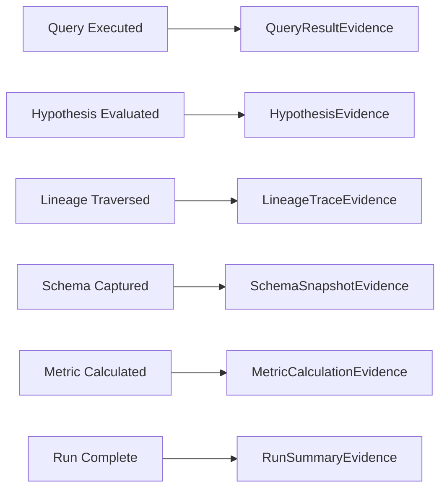

# Evidence Types

Evidence is the structured output of investigations. Every piece of evidence has a `kind` discriminator that determines its shape and how it should be rendered.

---

## Overview

When Dataing investigates a data quality issue, it produces evidence at each step:



Evidence is:

- **Queryable** — Filter across runs by kind, verdict, or content
- **Typed** — Each kind has a specific schema for type-safe rendering
- **Ordered** — Sequence numbers maintain chronological order
- **Hashable** — Content hashes enable verification and deduplication

---

## Evidence Kinds

The `EvidenceKind` enum defines the types of evidence that can be collected:

| Kind | Value | Description |
|------|-------|-------------|
| `QUERY_RESULT` | `query_result` | SQL query execution results |
| `HYPOTHESIS` | `hypothesis` | Hypothesis evaluation outcome |
| `LINEAGE_TRACE` | `lineage_trace` | Data lineage traversal |
| `SCHEMA_SNAPSHOT` | `schema_snapshot` | Table schema capture |
| `METRIC_CALCULATION` | `metric_calculation` | Calculated metric value |
| `RUN_SUMMARY` | `run_summary` | Investigation summary |

---

## Evidence Base

All evidence types share these common fields:

| Field | Type | Description |
|-------|------|-------------|
| `id` | `UUID` | Unique identifier |
| `run_id` | `UUID` | Parent run ID |
| `seq` | `int` | Sequence number for ordering (>= 1) |
| `kind` | `EvidenceKind` | Discriminator for evidence type |
| `timestamp` | `datetime` | When evidence was created |
| `prev_hash` | `str \| None` | Hash of previous evidence (for chain) |
| `content_hash` | `str` | SHA256 hash of content |

---

## Query Result Evidence

Captured when a SQL query is executed during investigation.

| Field | Type | Description |
|-------|------|-------------|
| `sql` | `str` | The SQL query executed |
| `row_count` | `int` | Number of rows returned |
| `columns` | `list[str]` | Column names |
| `sample_rows` | `list[dict]` | Sample of result rows |
| `execution_ms` | `int` | Query execution time in ms |
| `error` | `str \| None` | Error message if query failed |

**Example:**

```json
{
  "kind": "query_result",
  "sql": "SELECT channel, COUNT(*) as nulls FROM orders WHERE user_id IS NULL GROUP BY channel",
  "row_count": 3,
  "columns": ["channel", "nulls"],
  "sample_rows": [
    {"channel": "mobile_app", "nulls": 1523},
    {"channel": "web", "nulls": 12}
  ],
  "execution_ms": 45
}
```

---

## Hypothesis Evidence

Captured when a hypothesis is evaluated.

| Field | Type | Description |
|-------|------|-------------|
| `hypothesis_id` | `str` | ID of the hypothesis |
| `hypothesis_text` | `str` | The hypothesis statement |
| `confidence` | `float` | Confidence score 0-1 |
| `supporting_facts` | `list[str]` | Facts supporting the hypothesis |
| `verdict` | `HypothesisVerdict` | Evaluation verdict |
| `reasoning` | `str` | Explanation of verdict |

**Verdicts:**

| Verdict | Description |
|---------|-------------|
| `accepted` | Hypothesis confirmed by evidence |
| `rejected` | Hypothesis disproven by evidence |
| `inconclusive` | Insufficient evidence to decide |

**Example:**

```json
{
  "kind": "hypothesis",
  "hypothesis_id": "h_channel_specific",
  "hypothesis_text": "The null spike is specific to mobile app channel",
  "confidence": 0.92,
  "supporting_facts": [
    "99% of nulls occur on channel='mobile_app'",
    "Web channel null rate unchanged at 0.1%"
  ],
  "verdict": "accepted",
  "reasoning": "Strong correlation between mobile app and null user_id values"
}
```

---

## Lineage Trace Evidence

Captured when data lineage is traversed.

| Field | Type | Description |
|-------|------|-------------|
| `root_dataset` | `str` | Starting dataset for trace |
| `upstream` | `list[str]` | Upstream datasets |
| `downstream` | `list[str]` | Downstream datasets |
| `edges` | `list[dict]` | Lineage edges with source/target |

**Example:**

```json
{
  "kind": "lineage_trace",
  "root_dataset": "orders",
  "upstream": ["raw_events", "user_sessions"],
  "downstream": ["order_metrics", "daily_summary"],
  "edges": [
    {"source": "raw_events", "target": "orders"},
    {"source": "user_sessions", "target": "orders"}
  ]
}
```

---

## Schema Snapshot Evidence

Captured when a table schema is recorded.

| Field | Type | Description |
|-------|------|-------------|
| `dataset` | `str` | Dataset name |
| `columns` | `list[dict]` | Column definitions (name, type, nullable) |
| `row_count` | `int \| None` | Approximate row count |
| `last_modified` | `datetime \| None` | Last modification time |

**Example:**

```json
{
  "kind": "schema_snapshot",
  "dataset": "orders",
  "columns": [
    {"name": "order_id", "type": "VARCHAR", "nullable": false},
    {"name": "user_id", "type": "VARCHAR", "nullable": true},
    {"name": "amount", "type": "DECIMAL(10,2)", "nullable": false}
  ],
  "row_count": 1523847,
  "last_modified": "2024-01-15T10:30:00Z"
}
```

---

## Metric Calculation Evidence

Captured when a data quality metric is calculated.

| Field | Type | Description |
|-------|------|-------------|
| `metric_name` | `str` | Name of the metric |
| `metric_type` | `str` | Type of metric (count, rate, etc.) |
| `value` | `float` | Calculated metric value |
| `expected_value` | `float \| None` | Expected/baseline value |
| `deviation_pct` | `float \| None` | Percentage deviation from expected |
| `dimensions` | `dict[str, str]` | Dimension values for this calculation |

**Example:**

```json
{
  "kind": "metric_calculation",
  "metric_name": "null_rate",
  "metric_type": "rate",
  "value": 0.15,
  "expected_value": 0.01,
  "deviation_pct": 1400.0,
  "dimensions": {"column": "user_id", "table": "orders"}
}
```

---

## Run Summary Evidence

Captured at the end of an investigation run.

| Field | Type | Description |
|-------|------|-------------|
| `root_cause` | `str \| None` | Identified root cause |
| `confidence` | `float` | Confidence in finding (0-1) |
| `recommendations` | `list[str]` | Recommended actions |
| `hypotheses_evaluated` | `int` | Number of hypotheses evaluated |
| `queries_executed` | `int` | Number of queries executed |
| `duration_seconds` | `float` | Total run duration |

**Example:**

```json
{
  "kind": "run_summary",
  "root_cause": "Mobile app v2.3.1 bug - checkout API not passing user context",
  "confidence": 0.95,
  "recommendations": [
    "Roll back mobile app to v2.3.0",
    "Fix user context passing in checkout API"
  ],
  "hypotheses_evaluated": 5,
  "queries_executed": 12,
  "duration_seconds": 45.2
}
```

---

## Querying Evidence

Evidence can be queried by kind across runs:

```sql
-- Find all accepted hypotheses for a table
SELECT content->>'hypothesis_text', content->>'confidence'
FROM sdk_evidence
WHERE kind = 'hypothesis'
  AND content->>'verdict' = 'accepted'
  AND content @> '{"supporting_facts": ["orders"]}'
ORDER BY created_at DESC;
```

---

## Hash Chain (Enterprise)

For enterprise customers requiring tamper-evident audit trails, evidence can be chained using cryptographic hashes.

!!! info "Opt-in Feature"
    Hash chain is disabled by default. Enable via environment variable:
    ```bash
    export EVIDENCE_HASH_CHAIN=true
    ```

When enabled:

- Each evidence item includes `prev_hash` pointing to the previous item
- `content_hash` is always computed as SHA256 of the content
- The chain can be verified to detect any tampering

**Verification:**

```python
def verify_chain(evidence_items: list) -> bool:
    for i, item in enumerate(evidence_items[1:], 1):
        expected_prev = evidence_items[i-1].content_hash
        if item.prev_hash != expected_prev:
            return False
    return True
```

---

## See Also

- [How Investigations Work](investigations.md) - Investigation lifecycle
- [SDK Reference](../guides/sdk-reference.md) - Programmatic access to evidence
- [Notebook Workflow](../guides/notebook-workflow.md) - Viewing evidence in notebooks
