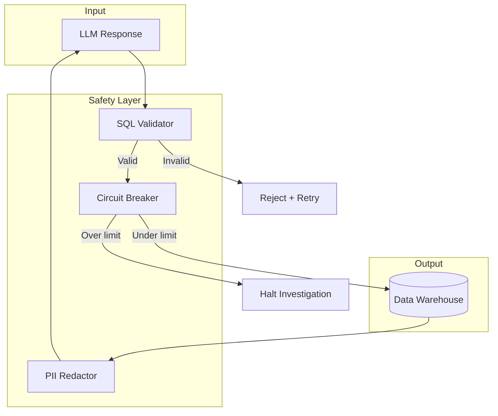
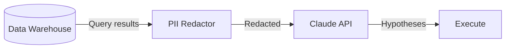

# Safety & Guardrails

dataing implements multiple layers of protection to ensure safe, bounded execution of AI-powered investigations.

---

## Defense in Depth

Every query and action passes through multiple safety checks:



---

## SQL Validator

The SQL validator ensures only safe, read-only queries are executed.

### How It Works

All queries are parsed using [sqlglot](https://github.com/tobymao/sqlglot) for AST-based validation:

```python
from dataing.safety.validator import validate_query

# This passes
validate_query("SELECT * FROM orders LIMIT 100")

# These raise QueryValidationError
validate_query("DROP TABLE orders")           # Forbidden statement
validate_query("SELECT * FROM orders")        # Missing LIMIT
validate_query("UPDATE orders SET x = 1")     # Forbidden statement
```

### Validation Checks

| Check | Description | Example |
|-------|-------------|---------|
| **Statement Type** | Must be SELECT | `DROP TABLE` → rejected |
| **LIMIT Required** | Must have LIMIT clause | `SELECT *` → rejected |
| **Forbidden Nodes** | No dangerous AST nodes | `DELETE` in subquery → rejected |
| **Forbidden Keywords** | Block dangerous words | `TRUNCATE` → rejected |

### Forbidden Statements

These statement types are **never allowed**:

```python
FORBIDDEN_STATEMENTS = {
    Delete,
    Drop,
    TruncateTable,
    Update,
    Insert,
    Create,
    Alter,
    Grant,
    Revoke,
}
```

### Forbidden Keywords

These keywords are blocked even in comments or strings:

```python
FORBIDDEN_KEYWORDS = {
    "DROP", "DELETE", "TRUNCATE", "UPDATE", "INSERT",
    "CREATE", "ALTER", "GRANT", "REVOKE", "EXECUTE", "EXEC"
}
```

### LIMIT Enforcement

Queries without LIMIT are either rejected or auto-limited:

```python
# Automatic LIMIT addition (fallback)
add_limit_if_missing("SELECT * FROM orders")
# Returns: "SELECT * FROM orders LIMIT 10000"
```

!!! warning "AST Parsing Cannot Be Bypassed"
    Unlike regex-based validation, sqlglot parses SQL into an abstract syntax tree. SQL injection tricks like comment obfuscation don't work:

    ```sql
    -- This still gets caught
    SELECT * FROM orders; --DROP TABLE users
    ```

---

## Circuit Breaker

The circuit breaker prevents runaway investigations from consuming excessive resources.

### Default Limits

| Limit | Default | Purpose |
|-------|---------|---------|
| `max_total_queries` | 50 | Total queries per investigation |
| `max_queries_per_hypothesis` | 5 | Queries per hypothesis |
| `max_retries_per_hypothesis` | 2 | Retry attempts per hypothesis |
| `max_consecutive_failures` | 3 | Failures before halt |
| `max_duration_seconds` | 600 | 10-minute timeout |

### Configuration

```python
from dataing.safety.circuit_breaker import CircuitBreakerConfig, CircuitBreaker

config = CircuitBreakerConfig(
    max_total_queries=50,
    max_queries_per_hypothesis=5,
    max_retries_per_hypothesis=2,
    max_consecutive_failures=3,
    max_duration_seconds=600,
)

breaker = CircuitBreaker(config)
```

### Checks Performed

The circuit breaker checks these conditions **before every query**:

```python
def check(self, events: list[Event], hypothesis_id: str | None = None):
    self._check_total_queries(events)
    self._check_consecutive_failures(events)
    self._check_duplicate_queries(events, hypothesis_id)

    if hypothesis_id:
        self._check_hypothesis_queries(events, hypothesis_id)
        self._check_hypothesis_retries(events, hypothesis_id)
```

### Stall Detection

The breaker detects when the LLM generates identical failing queries:

```python
# If the same query is generated twice in a row, investigation stalls
if len(queries) >= 2 and queries[-1] == queries[-2]:
    raise CircuitBreakerTripped("Duplicate query detected - investigation stalled")
```

### Tripping the Breaker

When any limit is exceeded, the investigation halts immediately:

```python
# Example: Total query limit reached
raise CircuitBreakerTripped(
    "Total query limit reached: 50/50"
)
```

---

## PII Redactor

The PII redactor detects and masks personally identifiable information before it reaches the LLM.

### Detected Patterns

| Type | Pattern | Redacted As |
|------|---------|-------------|
| Email | `user@domain.com` | `[REDACTED_EMAIL]` |
| SSN | `XXX-XX-XXXX` | `[REDACTED_SSN]` |
| Credit Card | `XXXX-XXXX-XXXX-XXXX` | `[REDACTED_CREDIT_CARD]` |
| Phone | `XXX-XXX-XXXX` | `[REDACTED_PHONE]` |
| ZIP Code | `XXXXX(-XXXX)` | `[REDACTED_ZIP_CODE]` |

### How It Works

```python
from dataing.safety.pii import redact_pii, scan_for_pii

# Scanning
scan_for_pii("Contact: john@example.com")
# Returns: ["email"]

# Redaction
redact_pii("SSN: 123-45-6789, Card: 4111-1111-1111-1111")
# Returns: "SSN: [REDACTED_SSN], Card: [REDACTED_CREDIT_CARD]"
```

### Integration Points

PII redaction happens at two points:

1. **Query Results** - Before results are sent to the LLM
2. **Context Data** - Before any metadata is processed



### Dictionary Redaction

For structured data, all string values are redacted:

```python
from dataing.safety.pii import redact_dict

data = {
    "email": "john@example.com",
    "phone": "555-123-4567",
    "name": "John Doe"  # Not a known PII pattern, kept as-is
}

redacted = redact_dict(data)
# {"email": "[REDACTED_EMAIL]", "phone": "[REDACTED_PHONE]", "name": "John Doe"}
```

---

## Rate Limiting

Beyond the circuit breaker, dataing implements rate limiting at the API level:

### Per-Tenant Limits

| Resource | Limit | Window |
|----------|-------|--------|
| Investigations | 100 | Hour |
| API Requests | 1000 | Hour |
| LLM Tokens | 1M | Day |

### Headers

Rate limit status is returned in response headers:

```
X-RateLimit-Limit: 100
X-RateLimit-Remaining: 87
X-RateLimit-Reset: 1705320000
```

---

## Audit Logging

All safety events are logged for compliance and debugging:

### Logged Events

| Event | Logged Data |
|-------|-------------|
| `query_validated` | Query hash, validation result |
| `query_rejected` | Query, rejection reason |
| `circuit_breaker_check` | Limits checked, current counts |
| `circuit_breaker_tripped` | Limit exceeded, investigation ID |
| `pii_detected` | PII types found, field names |
| `pii_redacted` | Redaction counts by type |

### Example Log Entry

```json
{
  "timestamp": "2024-01-15T10:30:00Z",
  "event": "circuit_breaker_check",
  "investigation_id": "inv_abc123",
  "limits": {
    "total_queries": {"current": 12, "max": 50},
    "hypothesis_queries": {"current": 3, "max": 5}
  },
  "result": "passed"
}
```

---

## Best Practices

!!! tip "Let the Safety Layer Work"
    Don't try to bypass safety checks. If your queries are being rejected, the system is working correctly. Adjust your approach or configuration instead.

!!! tip "Monitor Circuit Breaker Trips"
    Frequent circuit breaker trips may indicate:

    - Queries too complex for the data
    - LLM generating poor hypotheses
    - Data quality issues in the source

!!! tip "Review PII Patterns"
    If legitimate data is being redacted, you can customize PII patterns. Contact support for enterprise pattern customization.

---

## Learn More

- [Data Privacy](../security/data-privacy.md) - Full privacy documentation
- [Architecture](../architecture.md) - System overview
- [How Investigations Work](investigations.md) - Investigation workflow
