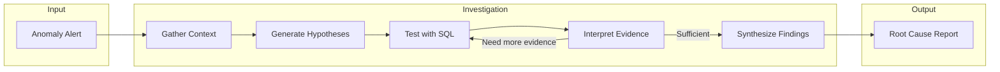
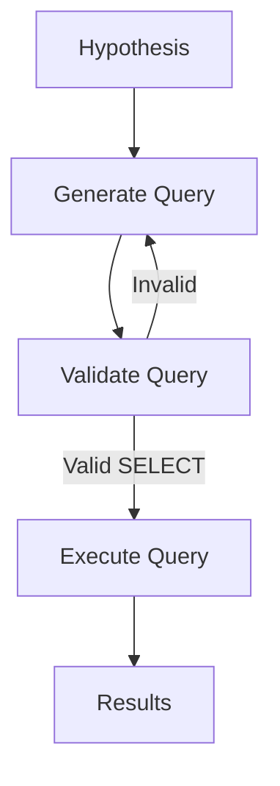
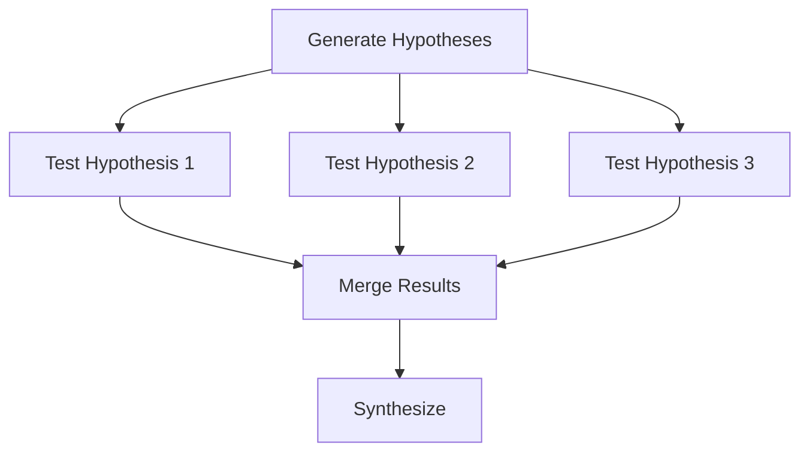
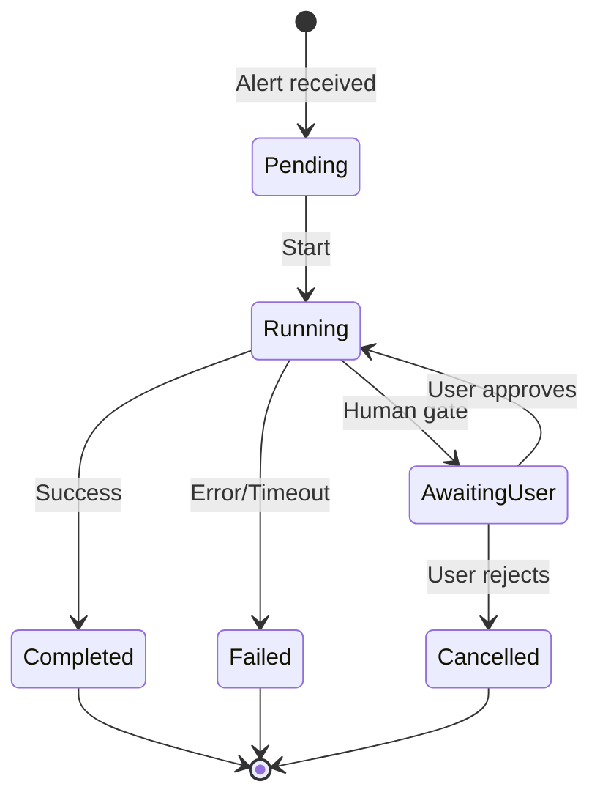

# How Investigations Work

dataing follows a systematic investigation workflow to transform anomaly alerts into actionable root cause analysis.

---

## The Investigation Loop

Investigations run **asynchronously** in the background. When you start an investigation, the API returns immediately with an ID, while a worker process handles the execution. This ensures resilience for long-running analyses.

Every investigation follows a deterministic loop:



---

## Step 1: Gather Context

Before generating hypotheses, dataing collects comprehensive context about the affected data:

### What We Gather

| Context Type | Source | Purpose |
|-------------|--------|---------|
| **Table Schema** | `INFORMATION_SCHEMA` | Column names, types, constraints |
| **Column Statistics** | Sample queries | NULL rates, cardinality, distributions |
| **Lineage** | dbt, DataHub | Upstream dependencies, transformations |
| **Recent Changes** | Metadata | Schema changes, pipeline failures |

### Example Context

```python
{
    "table": "orders",
    "schema": {
        "columns": [
            {"name": "id", "type": "UUID", "nullable": False},
            {"name": "user_id", "type": "UUID", "nullable": True},
            {"name": "total", "type": "DECIMAL", "nullable": False},
            {"name": "created_at", "type": "TIMESTAMP", "nullable": False},
        ]
    },
    "statistics": {
        "user_id": {"null_rate": 0.15, "cardinality": 8542},
        "total": {"mean": 127.50, "min": 0.01, "max": 9999.99}
    },
    "lineage": {
        "upstream": ["raw.checkout_events", "dim.users"],
        "transformations": ["dedup", "enrich_user_data"]
    }
}
```

---

## Step 2: Generate Hypotheses

The LLM analyzes the context and generates multiple potential root causes:

### Hypothesis Generation

```python
# Example hypotheses for NULL user_id spike
hypotheses = [
    {
        "id": "hyp_1",
        "description": "Mobile app bug not passing user context",
        "test_query": "SELECT channel, COUNT(*) WHERE user_id IS NULL GROUP BY channel"
    },
    {
        "id": "hyp_2",
        "description": "Guest checkout flow increased",
        "test_query": "SELECT is_guest, COUNT(*) GROUP BY is_guest"
    },
    {
        "id": "hyp_3",
        "description": "Data pipeline dropped user_id join",
        "test_query": "SELECT DATE(created_at), AVG(CASE WHEN user_id IS NULL THEN 1 ELSE 0 END) GROUP BY 1"
    }
]
```

### Why Multiple Hypotheses?

- **Parallel Testing**: All hypotheses tested simultaneously (branching)
- **Evidence-Based**: Each hypothesis is validated with SQL queries
- **No Confirmation Bias**: The LLM doesn't commit to a single theory

---

## Step 3: Test with SQL

Each hypothesis is tested by executing SQL queries against your data warehouse:



### Query Safety

All queries pass through the safety layer:

1. **SQL Validation** - Only SELECT statements with LIMIT
2. **PII Redaction** - Sensitive data masked before LLM sees results
3. **Circuit Breaker** - Max 50 queries, 5 per hypothesis

### Example Test Query

```sql
-- Testing hypothesis: Mobile app bug
SELECT
    channel,
    COUNT(*) as total_orders,
    SUM(CASE WHEN user_id IS NULL THEN 1 ELSE 0 END) as null_count,
    ROUND(100.0 * SUM(CASE WHEN user_id IS NULL THEN 1 ELSE 0 END) / COUNT(*), 2) as null_pct
FROM orders
WHERE created_at >= '2024-01-10'
GROUP BY channel
ORDER BY null_pct DESC
LIMIT 100;
```

---

## Step 4: Interpret Evidence

The LLM analyzes query results to support or refute each hypothesis:

### Evidence Interpretation

```python
{
    "hypothesis": "Mobile app bug not passing user context",
    "query_result": {
        "mobile_app": {"total": 1200, "null_pct": 85.2},
        "web": {"total": 3500, "null_pct": 1.1},
        "api": {"total": 800, "null_pct": 0.8}
    },
    "interpretation": {
        "supports_hypothesis": True,
        "confidence": 0.92,
        "reasoning": "NULLs are concentrated in mobile_app channel (85%) vs web (1%)"
    }
}
```

### Iterative Refinement

If evidence is inconclusive, the LLM may:

- Generate follow-up queries for more detail
- Request additional context (e.g., app version breakdown)
- Revise or combine hypotheses

---

## Step 5: Synthesize Findings

The final step synthesizes all evidence into a root cause report:

### Synthesis Output

```json
{
    "root_cause": {
        "summary": "Mobile app v2.3.1 bug - checkout API not passing user context",
        "confidence": 0.95,
        "affected_scope": "304 orders from 2024-01-12 to 2024-01-14"
    },
    "supporting_evidence": [
        "NULLs occur exclusively on channel='mobile_app'",
        "Affected orders have app_version='2.3.1'",
        "Web orders and v2.3.0 mobile orders are unaffected"
    ],
    "recommended_actions": [
        "Roll back mobile app to v2.3.0",
        "Fix user context passing in checkout API",
        "Backfill user_id from session data where possible"
    ],
    "related_investigations": []
}
```

---

## Parallel Hypothesis Testing

dataing tests hypotheses in parallel using **branching**:



This parallelization:

- **Reduces investigation time** - All hypotheses tested simultaneously
- **Prevents tunnel vision** - No premature commitment to one theory
- **Enables comparison** - Easy to see which hypothesis has strongest evidence

---

## Human-in-the-Loop Gates

At key decision points, investigations can pause for human review:

| Gate | When | User Action |
|------|------|-------------|
| **Before SQL Execution** | Optional | Review generated queries |
| **After Hypothesis Selection** | Configurable | Approve hypotheses to test |
| **Before Final Report** | Optional | Review findings before delivery |

[Learn about the workflow engine](agent-workflows.md)

---

## Investigation Lifecycle



---

## Learn More

<div class="grid cards" markdown>

-   :material-state-machine: **[Agent Workflows (Maestro)](agent-workflows.md)**

    ---

    The workflow engine powering investigations

-   :material-shield: **[Safety & Guardrails](guardrails.md)**

    ---

    Query validation and execution limits

-   :material-lock: **[Data Privacy](../security/data-privacy.md)**

    ---

    PII protection and data handling

</div>
