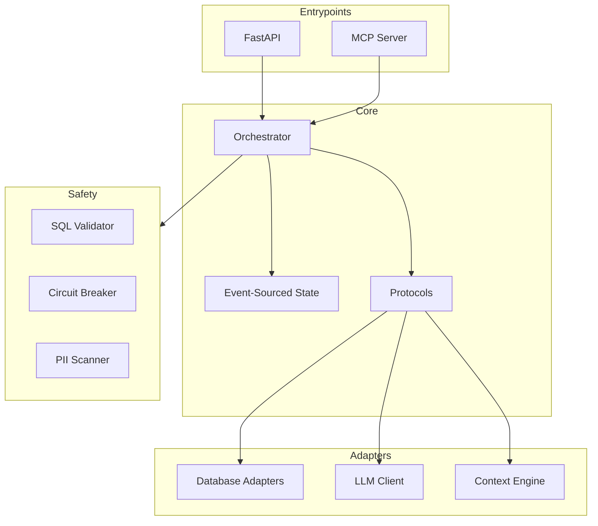

# dataing

**Autonomous Data Quality Investigation**

dataing is an AI-powered system that automatically investigates data quality anomalies
and identifies root causes. When your data observability tool detects an anomaly,
dataing takes over to determine what went wrong.

## Key Features

- **Autonomous Investigation**: Generates hypotheses and tests them automatically
- **SQL Safety**: All queries validated with sqlglot - no mutations allowed
- **Event Sourcing**: Complete audit trail of every investigation
- **Fail Fast**: Empty schema discovery stops immediately with clear error
- **Parallel Processing**: Multiple hypotheses investigated concurrently
- **MCP Integration**: Use as a tool in Claude and other MCP clients

## Architecture



## Quick Start

```bash
# Clone the repository
git clone https://github.com/dataing/dataing
cd dataing

# Install dependencies
just setup

# Start development servers
just dev
```

## Design Principles

| Principle | Implementation |
|-----------|----------------|
| **FAIL FAST** | Empty schema raises `SchemaDiscoveryError` immediately |
| **Event Sourcing** | Retry counts derived from events, not mutable counters |
| **Immutability** | All domain models are frozen |
| **Safety First** | sqlglot parsing + circuit breakers + no mutations |
| **Hexagonal Architecture** | Core has zero external imports |
| **Pure Python** | No LangGraph, just asyncio.gather |
| **< 5k Lines** | Simplicity over features |
