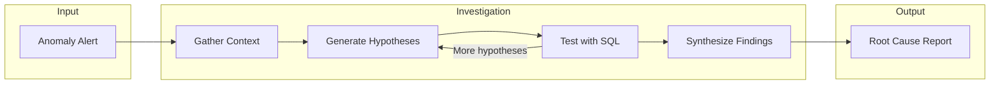

---
hide:
  - navigation
  - toc
---

<h1 class="hero-text">The AI Data Reliability Engineer</h1>

Dataing autonomously investigates data quality issues in your data. It doesn't just alert you—it finds the root cause.

[Get Started](quickstart.md){ .md-button .md-button--primary }
&nbsp;&nbsp;
[Read Architecture](architecture.md){ .md-button }

-   :material-robot-excited: **Autonomous Agents**

    ---

    Unlike dumb monitors, Dataing orchestrates **Agents** to hypothesize, query, and verify issues just like a human engineer would.

    [How it works](concepts/investigations.md)

-   :material-shield-check: **Safety First**

    ---

    Built on a deterministic Finite State Machine. Read-only adapters, circuit breakers, and human-in-the-loop gates ensure safety.

    [View Security](security/data-privacy.md)

-   :material-connection: **Plug & Play**

    ---

    Flexible architecture means you can plug in **Snowflake**, **dbt**, **Slack**, or **DataHub** in minutes.

    [See Integrations](integrations/warehouses/snowflake.md)

-   :material-flash: **Instant RCA**

    ---

    Stop writing `SELECT *` to debug null spikes. Dataing correlates lineage, schema changes, and data stats automatically.

    [Try Quickstart](quickstart.md)

---

## Why Dataing?

The modern data stack is great at **alerting** ("Something is wrong!") but terrible at **diagnosis** ("Why is it wrong?").

Data Engineers spend 30% of their time debugging pipelines. Dataing automates the "Check Lineage → Check recent deployments → Check data distribution" loop so you can focus on building.

---

## How It Works

```mermaid
flowchart LR
    subgraph Input
        A[Anomaly Alert]
    end

    subgraph Investigation
        B[Gather Context]
        C[Generate Hypotheses]
        D[Test with SQL]
        E[Synthesize Findings]
    end

    subgraph Output
        F[Root Cause Report]
    end

    A --> B
    B --> C
    C --> D
    D --> E
    E --> F

    D -->|More hypotheses| C
```

1. **Gather Context** — Collects table schemas, column statistics, and lineage
2. **Generate Hypotheses** — LLM analyzes patterns and proposes root causes
3. **Test with SQL** — Validates each hypothesis with safe, read-only queries
4. **Synthesize Findings** — Produces a clear report with supporting evidence

---

## Integrations

| Data Warehouses | Status |
|-----------------|--------|
| Snowflake | :material-check-circle:{ .green } GA |
| BigQuery | :material-check-circle:{ .green } GA |
| DuckDB | :material-check-circle:{ .green } GA |
| PostgreSQL | :material-check-circle:{ .green } GA |
| Redshift | :material-clock-outline:{ .yellow } Coming Soon |

| Lineage & Notifications | Status |
|-------------------------|--------|
| dbt | :material-check-circle:{ .green } GA |
| DataHub | :material-check-circle:{ .green } GA |
| Slack | :material-check-circle:{ .green } GA |
| OpenLineage | :material-clock-outline:{ .yellow } Coming Soon |

[View all integrations](integrations/warehouses/snowflake.md){ .md-button }

---

## Open Source

Dataing is open-core:

- **Community Edition** — Fully open source under Apache 2.0
- **Enterprise Edition** — Adds SSO, SCIM, audit logging, and premium support

[View on GitHub :material-github:](https://github.com/bordumb/dataing){ .md-button }
