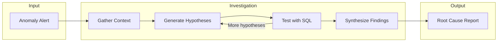

# The AI Data Reliability Engineer

**Detect anomalies. Generate hypotheses. Test with SQL. Find root causes.**

dataing is an autonomous AI agent that investigates data quality issues in your warehouse. When your data observability tool detects an anomaly, dataing takes over to determine *what went wrong* and *why*.

<div class="grid cards" markdown>

-   :material-magnify: **Auto Root Cause Analysis**

    ---

    LLMs generate and test multiple hypotheses in parallel. No more manual SQL hunting.

-   :material-shield-check: **Read-Only by Design**

    ---

    Only SELECT queries, never modifies your data. Every query validated with sqlglot.

-   :material-account-check: **Human-in-the-Loop Gates**

    ---

    Review and approve before any action. Full audit trail of every investigation.

</div>

[Get Started](quickstart.md){ .md-button .md-button--primary }
[View on GitHub](https://github.com/bordumb/dataing){ .md-button }

---

## How It Works

dataing follows a systematic investigation workflow powered by an agentic finite state machine:


```mermaid
flowchart LR
    subgraph Input
        A[Anomaly Alert]
    end

    subgraph Investigation
        B[Gather Context]
        C[Generate Hypotheses]
        D[Test with SQL]
        E[Synthesize Findings]
    end

    subgraph Output
        F[Root Cause Report]
    end

    A --> B
    B --> C
    C --> D
    D --> E
    E --> F

    D -->|More hypotheses| C
```

1. **Gather Context** - Collects table schemas, column statistics, and lineage information
2. **Generate Hypotheses** - LLM analyzes patterns and proposes potential root causes
3. **Test with SQL** - Validates each hypothesis with safe, read-only queries
4. **Synthesize Findings** - Produces a clear root cause report with supporting evidence

---

## Architecture

Built on a hexagonal architecture with agentic workflows:

<div class="grid" markdown>

:material-hexagon-outline: **Hexagonal Architecture**

Core domain logic is isolated from external dependencies. Swap adapters without touching business logic.

:material-state-machine: **Agentic FSM (Maestro)**

Workflow engine with typed steps, signals, and branching. Deterministic execution with human-in-the-loop gates.

:material-robot: **Agent Runtime (Bond)**

PydanticAI wrapper for LLM interactions with high-fidelity streaming and structured outputs.

:material-shield-lock: **Safety Layer**

Circuit breakers, query validation, and PII detection. Prevents runaway costs and data exposure.

</div>

[Learn more about the architecture](architecture.md){ .md-button }

---

## Integrations

### Data Warehouses

<div class="grid" markdown>

| Warehouse | Status |
|-----------|--------|
| Snowflake | :material-check-circle:{ .green } GA |
| BigQuery | :material-check-circle:{ .green } GA |
| DuckDB | :material-check-circle:{ .green } GA |
| PostgreSQL | :material-check-circle:{ .green } GA |
| Redshift | :material-clock-outline: Coming Soon |

</div>

### Lineage Providers

| Provider | Status |
|----------|--------|
| dbt | :material-check-circle:{ .green } GA |
| DataHub | :material-check-circle:{ .green } GA |
| OpenLineage | :material-clock-outline: Coming Soon |
| Dagster | :material-clock-outline: Coming Soon |

[View all integrations](integrations/warehouses/snowflake.md){ .md-button }

---

## Enterprise Ready

<div class="grid cards" markdown>

-   :material-lock: **Security First**

    ---

    Read-only access, PII detection, and query validation. [Learn about our security model](security/data-privacy.md).

-   :material-account-group: **SSO & RBAC**

    ---

    OIDC/SAML authentication and role-based access control. Enterprise Edition feature.

-   :material-server: **Self-Hosted Option**

    ---

    Deploy in your own infrastructure. Data never leaves your network.

</div>

---

## Quick Start

Get up and running in 5 minutes:

=== "pip"

    ```bash
    pip install dataing-core
    ```

=== "uv"

    ```bash
    uv add dataing-core
    ```

Then configure your data warehouse and run your first investigation:

```bash
dataing investigate \
  --datasource snowflake \
  --table orders \
  --column revenue \
  --anomaly "null_rate spike on 2024-01-15"
```

[Full quickstart guide](quickstart.md){ .md-button .md-button--primary }

---

## Open Source

dataing is open-core:

- **Community Edition** - Fully open source under Apache 2.0
- **Enterprise Edition** - Adds SSO, SCIM, audit logging, and premium support

[View on GitHub :material-github:](https://github.com/bordumb/dataing){ .md-button }
