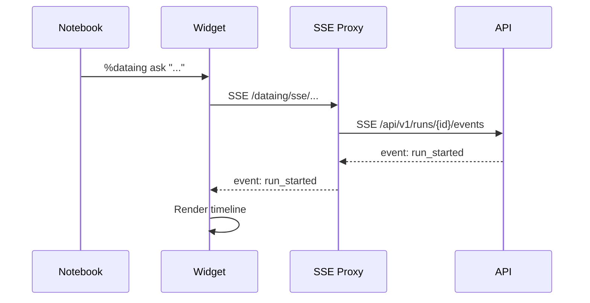

# JupyterLab Extension

The Dataing JupyterLab extension provides a sidebar widget for monitoring investigation status, viewing evidence timelines, and managing datasource attachments.

---

## Features

- **Connection Status** — Real-time indicator showing API connectivity
- **Datasource Attachment** — Display currently attached datasource
- **Evidence Timeline** — Stream investigation events with visual icons
- **SSE Proxy** — Built-in proxy for cross-origin event streaming

---

## Installation

### From PyPI (Recommended)

```bash
pip install jupyterlab-dataing
```

### From Source

```bash
cd frontend/jupyterlab-dataing

# Install build dependencies
pip install hatchling hatch-jupyter-builder hatch-nodejs-version

# Build TypeScript (requires npm/jlpm)
npm install
npm run build:lib
jupyter labextension build .

# Install the Python package
pip install .
```

### Verify Installation

```bash
jupyter labextension list
```

You should see `@dataing/jupyterlab-dataing` in the list:

```
@dataing/jupyterlab-dataing v0.1.0 enabled OK (python, jupyterlab-dataing)
```

---

## Usage

### Starting JupyterLab

```bash
# Ensure the Dataing backend is running
just dev-backend

# Start JupyterLab
jupyter lab
```

### Opening the Sidebar

1. Open JupyterLab (usually at http://localhost:8888)
2. Look for the Dataing icon in the left sidebar, or
3. View menu → Activate Command Palette → search "Dataing"

### Connection Status

The sidebar shows connection status with color-coded indicators:

| Color | Status | Description |
|-------|--------|-------------|
| Green | Connected | API is reachable |
| Gray | Disconnected | Not connected to API |
| Yellow | Checking | Connection check in progress |
| Red | Error | Connection failed |

### Attaching Datasources

Use the notebook magics to attach a datasource:

```python
%dataing attach postgres://db.schema.orders
```

The sidebar will display:
- Datasource name
- Detach button

### Timeline View

When an investigation runs, the sidebar streams events in real-time:

| Icon | Event Type | Description |
|------|------------|-------------|
| Rocket | `run_started` | Investigation began |
| Hourglass | `run_progress` | Processing in progress |
| Clipboard | `run_evidence` | Evidence collected |
| Checkmark | `run_completed` | Investigation succeeded |
| Cross | `run_failed` | Investigation failed |
| Heartbeat | `run_heartbeat` | Keep-alive signal |

---

## Architecture



### SSE Proxy

The server extension provides an SSE proxy to avoid CORS issues:

```
Notebook → Server Extension → Dataing API
         ↓
  /dataing/sse/api/v1/runs/{id}/events
```

This allows the widget to stream events without configuring CORS headers on the backend.

---

## Configuration

### Backend URL

Set via environment variable:

```bash
export DATAING_BASE_URL=http://localhost:8000
```

Or configure in the notebook:

```python
%dataing connect --base-url https://api.dataing.io
```

### CORS (Direct Connection)

If not using the SSE proxy, configure CORS on the backend:

```python
# dataing/entrypoints/api/app.py
app.add_middleware(
    CORSMiddleware,
    allow_origins=["http://localhost:8888"],  # JupyterLab origin
    allow_methods=["*"],
    allow_headers=["*"],
)
```

Then connect with `useProxy=false`:

```typescript
widget.streamRun(runId, serverBaseUrl, false);
```

---

## Widget API

### DataingWidget

The main sidebar widget class:

```typescript
class DataingWidget extends Widget {
    // Update from external state
    updateFromState(appState: IDataingState): void;

    // Attach to a datasource
    attach(datasourceId: string, name?: string): void;

    // Detach from current datasource
    detach(): void;

    // Start streaming SSE events
    streamRun(runId: string, serverBaseUrl: string, useProxy?: boolean): void;

    // Stop streaming
    stopStream(): void;
}
```

### IDataingWidgetState

```typescript
interface IDataingWidgetState {
    connectionState: 'connected' | 'disconnected' | 'checking' | 'error';
    backendUrl: string;
    attachedDatasource: string | null;
    currentRunId: string | null;
    timeline: IEvidenceEvent[];
    errorMessage: string | null;
}
```

### IEvidenceEvent

```typescript
interface IEvidenceEvent {
    seq: number;
    event: string;
    run_id: string;
    data: Record<string, unknown>;
    timestamp: string | null;
}
```

---

## Troubleshooting

### Widget Not Appearing

1. Verify extension is installed: `jupyter labextension list`
2. Rebuild if needed: `jupyter lab build`
3. Check browser console for errors

### Connection Errors

1. Ensure the Dataing API is running
2. Check `DATAING_BASE_URL` is set correctly
3. Verify network connectivity

### SSE Stream Disconnects

1. Check backend is running and healthy
2. Look for timeout errors in server logs
3. Try the `--no-stream` flag in notebook magics

### CORS Errors

If not using the proxy:
1. Configure CORS on the Dataing API
2. Ensure JupyterLab origin is in allowed origins

---

## Development

### Build Extension

```bash
cd frontend/jupyterlab-dataing

# Install build tools
pip install hatchling hatch-jupyter-builder hatch-nodejs-version

# Install JS dependencies
npm install

# Build TypeScript
npm run build:lib

# Build labextension
jupyter labextension build .
```

### Watch Mode

```bash
npm run watch:src
```

### Install for Development

```bash
# Install the package
pip install .

# Verify
jupyter labextension list
```

### Start JupyterLab

```bash
jupyter lab
```

### Local Dev Notes

If you are running `just demo`, JupyterLab uses the repo `.venv`. Make sure the
labextension symlink is created in that environment and points at the worktree
build.

```bash
cd frontend/jupyterlab-dataing
jlpm build
uv run jupyter labextension develop . --overwrite
```

Verify the symlink target and that the new bundle is loaded:

```bash
ls -l .venv/share/jupyter/labextensions/@dataing/jupyterlab-dataing
```

In the browser console, `window.__dataingJupyterlabActivated === true` confirms
the new bundle is running and you should see "Dataing JupyterLab extension activated".

---

## See Also

- [Notebook Workflow](../guides/notebook-workflow.md) - Magic commands
- [SDK Reference](../guides/sdk-reference.md) - Python client
- [Evidence Types](../concepts/evidence.md) - Event data structures
