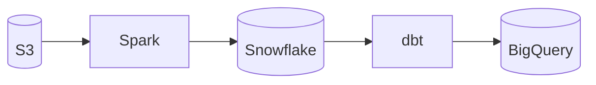

# DataHub Integration

Connect dataing to DataHub for enterprise data lineage and metadata.

---

## What It Enables

With DataHub integration, dataing can:

- **Access centralized lineage** - Enterprise-wide data lineage graph
- **Leverage rich metadata** - Schemas, owners, tags, glossary terms
- **Trace cross-system flows** - Lineage across multiple platforms
- **Use business context** - Documentation and domain classification

---

## Prerequisites

- DataHub instance (Cloud or self-hosted)
- API token with `LINEAGE_VIEWER` permissions
- Network access from dataing to DataHub API

---

## Configuration

=== "Environment Variables"

    ```bash
    export DATAING_LINEAGE_PROVIDER=datahub
    export DATAING_DATAHUB_URL=https://your-datahub.acryl.io
    export DATAING_DATAHUB_TOKEN=your-api-token
    ```

=== "Python SDK"

    ```python
    from dataing.adapters.lineage.datahub import DataHubLineageProvider

    provider = DataHubLineageProvider(
        url="https://your-datahub.acryl.io",
        token="your-api-token",
    )
    ```

### Configuration Fields

| Field | Required | Description |
|-------|----------|-------------|
| `url` | Yes | DataHub GMS or Cloud URL |
| `token` | Yes | API token for authentication |
| `timeout` | No | API timeout in seconds (default: 30) |

---

## What's Extracted

dataing queries DataHub's GraphQL API for:

| Data | GraphQL Query | Usage |
|------|--------------|-------|
| Upstream lineage | `upstreamLineage` | Find source tables |
| Downstream lineage | `downstreamLineage` | Find dependent tables |
| Schema metadata | `schemaMetadata` | Column types, descriptions |
| Ownership | `ownership` | Contact information |
| Tags | `tags` | Classification context |
| Glossary terms | `glossaryTerms` | Business definitions |

---

## Integration Points

### During Context Gathering

```python
# Example DataHub lineage context
{
    "urn": "urn:li:dataset:(urn:li:dataPlatform:snowflake,analytics.orders,PROD)",
    "upstream": [
        {
            "urn": "urn:li:dataset:(urn:li:dataPlatform:snowflake,raw.checkout,PROD)",
            "degree": 1
        },
        {
            "urn": "urn:li:dataset:(urn:li:dataPlatform:snowflake,raw.users,PROD)",
            "degree": 1
        }
    ],
    "downstream": [
        {
            "urn": "urn:li:dataset:(urn:li:dataPlatform:snowflake,analytics.revenue,PROD)",
            "degree": 1
        }
    ],
    "owners": ["data-team@company.com"],
    "tags": ["pii", "tier-1"],
    "domain": "Sales"
}
```

### Enriched Hypotheses

Business context improves hypothesis generation:

> "The `orders` table is tagged as `tier-1` and owned by `data-team@company.com`.
> It has upstream dependencies on `raw.checkout` and `raw.users`.
> A NULL spike in `user_id` could be caused by:
> 1. Changes to the `raw.users` ETL job
> 2. Schema drift in the `raw.checkout` source"

---

## API Permissions

Create a DataHub token with these permissions:

| Permission | Purpose |
|------------|---------|
| `LINEAGE_VIEWER` | Read lineage graph |
| `DATASET_VIEWER` | Read dataset metadata |
| `TAG_VIEWER` | Read tag information |

### Creating a Token

=== "DataHub Cloud"

    Navigate to **Settings** → **API Tokens** → **Create Token**

=== "Self-Hosted"

    ```bash
    # Using DataHub CLI
    datahub token create \
      --name "dataing-integration" \
      --permissions LINEAGE_VIEWER,DATASET_VIEWER
    ```

---

## Cross-Platform Lineage

DataHub can track lineage across multiple platforms:



dataing leverages this to trace anomalies to their true source, even across system boundaries.

---

## Troubleshooting

### "Authentication failed"

Check that:

- Token has correct permissions
- Token is not expired
- URL is correct (GMS URL, not frontend URL)

### "Dataset not found"

Ensure the dataset URN is correct:

```
urn:li:dataset:(urn:li:dataPlatform:snowflake,database.schema.table,PROD)
```

### Slow Queries

For large lineage graphs, increase the timeout:

```bash
export DATAING_DATAHUB_TIMEOUT=60
```

---

## Learn More

- [dbt Integration](dbt.md)
- [How Investigations Work](../../concepts/investigations.md)
- [Architecture](../../architecture.md)
