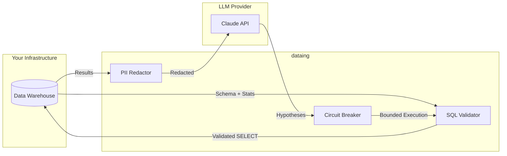

# Data Privacy

dataing is designed with **defense-in-depth**: multiple layers of protection ensure your data stays safe throughout every investigation.

---

## The Read-Only Promise

dataing only executes **SELECT** queries. We never modify your data.

### SQL Validation with sqlglot

Every query is parsed and validated using [sqlglot](https://github.com/tobymao/sqlglot) before execution:

```python
# From validator.py - these statements are NEVER allowed
FORBIDDEN_STATEMENTS = {
    Delete, Drop, TruncateTable, Update, Insert,
    Create, Alter, Grant, Revoke
}

FORBIDDEN_KEYWORDS = {
    "DROP", "DELETE", "TRUNCATE", "UPDATE", "INSERT",
    "CREATE", "ALTER", "GRANT", "REVOKE", "EXECUTE", "EXEC"
}
```

The validator performs multiple checks:

1. **AST Parsing** - Parse SQL into an abstract syntax tree
2. **Statement Type Check** - Must be a SELECT statement
3. **Forbidden Node Check** - Walk AST for dangerous statement types
4. **Keyword Scan** - Secondary check for forbidden keywords
5. **LIMIT Enforcement** - Every query must have a LIMIT clause

```python
# Queries without LIMIT are rejected or auto-limited
if not parsed.find(exp.Limit):
    raise QueryValidationError("Query must include LIMIT clause")
```

!!! note "No Bypass Possible"
    Unlike regex-based validation, AST parsing with sqlglot cannot be bypassed through SQL injection tricks or comment obfuscation.

---

## PII Protection

Before any data is sent to the LLM, dataing scans for and redacts personally identifiable information.

### Detected PII Types

| Type | Pattern | Example |
|------|---------|---------|
| Email | `user@domain.com` | `john@example.com` → `[REDACTED_EMAIL]` |
| SSN | `XXX-XX-XXXX` | `123-45-6789` → `[REDACTED_SSN]` |
| Credit Card | `XXXX-XXXX-XXXX-XXXX` | `4111-1111-1111-1111` → `[REDACTED_CREDIT_CARD]` |
| Phone | `XXX-XXX-XXXX` | `555-123-4567` → `[REDACTED_PHONE]` |
| ZIP Code | `XXXXX(-XXXX)` | `94105` → `[REDACTED_ZIP_CODE]` |

### How Redaction Works

```python
# PII is replaced before LLM processing
original = "Contact: john@example.com, SSN: 123-45-6789"
redacted = "Contact: [REDACTED_EMAIL], SSN: [REDACTED_SSN]"
```

The LLM never sees the actual PII values - only the redaction markers. This allows the model to understand the data structure without accessing sensitive information.

---

## LLM Data Handling

### What Data is Sent to the LLM

| Data Type | Sent | Notes |
|-----------|------|-------|
| Table schemas | Yes | Column names, types, constraints |
| Column statistics | Yes | NULL rates, cardinality, min/max |
| Sample row values | **No** | Only metadata, never actual data |
| Query results (counts) | Yes | Aggregate counts, not row data |
| PII values | **No** | Redacted before sending |

### Provider Commitments

dataing uses Anthropic's Claude API with these guarantees:

- **No training on customer data** - Your queries and results are not used for model training
- **Data encryption** - All API communication is encrypted in transit
- **Ephemeral processing** - Data is not persisted beyond the API call

---

## Circuit Breaker Protection

To prevent runaway investigations, dataing enforces strict execution limits:

| Limit | Default | Purpose |
|-------|---------|---------|
| Total queries | 50 | Prevent excessive warehouse load |
| Queries per hypothesis | 5 | Focus investigations |
| Retries per hypothesis | 2 | Avoid infinite loops |
| Consecutive failures | 3 | Detect stalled investigations |
| Maximum duration | 10 minutes | Time-bound execution |

```python
# From circuit_breaker.py
@dataclass(frozen=True)
class CircuitBreakerConfig:
    max_total_queries: int = 50
    max_queries_per_hypothesis: int = 5
    max_retries_per_hypothesis: int = 2
    max_consecutive_failures: int = 3
    max_duration_seconds: int = 600
```

When any limit is reached, the investigation stops immediately with a clear error message.

---

## Data Flow Summary



**Key guarantees:**

- Data never leaves your infrastructure except for redacted metadata
- No actual row data is sent to the LLM
- All queries are read-only and bounded
- PII is automatically detected and redacted
