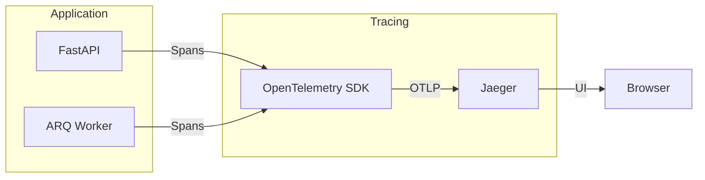

# Distributed Tracing with Jaeger

Dataing uses [Jaeger](https://www.jaegertracing.io/) for distributed tracing, enabling you to visualize and debug the complete lifecycle of investigations across API, queue, and worker components.

---

## What is Jaeger?

Jaeger is an open-source distributed tracing system originally developed by Uber. It helps you:

- **Track requests** across multiple services and components
- **Identify bottlenecks** by seeing exactly where time is spent
- **Debug failures** by tracing the full path of a failed request
- **Understand system behavior** through visual representations of service interactions

### Key Concepts

| Concept | Description |
|---------|-------------|
| **Trace** | The complete journey of a request through the system |
| **Span** | A single unit of work within a trace (e.g., "execute SQL query") |
| **Parent-Child** | Spans are linked hierarchically showing causation |
| **Tags** | Key-value metadata attached to spans (e.g., `investigation_id`) |
| **Correlation ID** | A unique identifier that links all operations for a single request |

---

## Why Tracing Matters for Dataing

Dataing investigations are **asynchronous** and **multi-step**:

```
API Request → Queue → Worker → LLM Calls → Database Queries → Response
```

Without tracing, debugging issues requires correlating logs across multiple components. With Jaeger, you see the entire flow in one view.

### Common Debugging Scenarios

| Scenario | Without Tracing | With Tracing |
|----------|----------------|--------------|
| Investigation is slow | Grep logs, guess which step | See exact timing per step |
| Investigation failed | Search multiple log files | Click trace, see error span |
| Queue backlog | Check Redis manually | See queue wait time in trace |
| LLM timeout | Check API logs | See LLM call duration in span |

---

## Architecture



### Trace Flow

1. **API receives request** → Creates root span with correlation ID
2. **Job enqueued** → Producer span created, trace context serialized to job payload
3. **Worker picks up job** → Consumer span created, linked to parent trace
4. **Steps execute** → Child spans for each workflow step
5. **Response returned** → Trace complete, visible in Jaeger

---

## Running Jaeger Locally

Jaeger starts automatically with the demo:

```bash
just demo
```

Access the UI at: **http://localhost:16686**

### Manual Start (Standalone)

```bash
docker run -d --name jaeger \
  -e COLLECTOR_OTLP_ENABLED=true \
  -p 16686:16686 \
  -p 4317:4317 \
  -p 4318:4318 \
  jaegertracing/all-in-one:2.14
```

---

## Using the Jaeger UI

### Finding Traces

1. Open http://localhost:16686
2. Select **Service**: `dataing-demo`
3. Click **Find Traces**

### Reading a Trace

```
▼ dataing-demo: POST /api/v1/investigations  [245ms]
  ├── investigation.enqueue                   [12ms]
  │   └── Tags: investigation_id=abc123, correlation_id=corr-xyz
  └── (continues in worker...)

▼ dataing-demo: investigation.process        [1.2s]
  ├── workflow.step.gather_context            [89ms]
  ├── workflow.step.generate_hypotheses       [523ms]
  │   └── Tags: hypothesis_count=3
  ├── workflow.step.execute_query             [156ms]
  │   └── Tags: query_count=3
  ├── workflow.step.interpret_evidence        [312ms]
  └── workflow.step.synthesize                [98ms]
```

### Key Things to Look For

| What | Where to Find | What it Means |
|------|---------------|---------------|
| Total duration | Root span | End-to-end investigation time |
| Queue wait | Gap between enqueue and process spans | Worker capacity issues |
| Slow steps | Individual step spans | LLM or database bottlenecks |
| Errors | Red spans with error tags | Where failures occurred |

---

## Example: Debugging a Slow Investigation

**Scenario**: A user reports their investigation took 45 seconds.

### Step 1: Find the Trace

Search by correlation ID (from response header) or time range:

```
Service: dataing-demo
Tags: correlation_id=user-reported-id
```

### Step 2: Analyze the Trace

```
▼ investigation.process                      [45.2s]
  ├── workflow.step.gather_context            [120ms]  ✓ Fast
  ├── workflow.step.generate_hypotheses       [890ms]  ✓ Normal
  ├── workflow.step.execute_query             [43.8s]  ⚠️ SLOW
  │   ├── sql.execute                         [42.1s]  ← Problem here
  │   │   └── Tags: query="SELECT ... FROM large_table"
  │   └── sql.execute                         [1.7s]
  └── workflow.step.synthesize                [390ms]  ✓ Normal
```

### Step 3: Root Cause

The `sql.execute` span shows a 42-second query. Click for details:

- **Query**: `SELECT * FROM large_table WHERE ...`
- **Rows scanned**: 50 million
- **Missing index**: True

**Fix**: Add index to `large_table` or optimize query.

---

## Querying Jaeger Programmatically

Jaeger exposes a REST API for programmatic access.

### List Services

```bash
curl -s http://localhost:16686/api/services | jq
```

```json
{
  "data": ["dataing-demo", "jaeger-all-in-one"],
  "total": 2
}
```

### Find Traces by Service

```bash
curl -s "http://localhost:16686/api/traces?service=dataing-demo&limit=10" | jq
```

### Find Traces by Tag

```bash
# Find by correlation ID
curl -s "http://localhost:16686/api/traces?service=dataing-demo&tags=%7B%22correlation_id%22%3A%22abc123%22%7D" | jq

# URL-decoded: tags={"correlation_id":"abc123"}
```

### Get Specific Trace

```bash
# Get trace by ID (from UI or previous query)
curl -s "http://localhost:16686/api/traces/0000000000000001" | jq
```

### Response Structure

```json
{
  "data": [
    {
      "traceID": "0000000000000001",
      "spans": [
        {
          "traceID": "0000000000000001",
          "spanID": "0000000001",
          "operationName": "POST /api/v1/investigations",
          "startTime": 1705356000000000,
          "duration": 245000,
          "tags": [
            {"key": "http.status_code", "value": 201},
            {"key": "correlation_id", "value": "corr-xyz"}
          ]
        }
      ],
      "processes": {
        "p1": {"serviceName": "dataing-demo"}
      }
    }
  ]
}
```

### Useful API Endpoints

| Endpoint | Description |
|----------|-------------|
| `GET /api/services` | List all services |
| `GET /api/traces?service=X` | Find traces by service |
| `GET /api/traces?service=X&tags={...}` | Find traces by tags |
| `GET /api/traces/{traceID}` | Get specific trace |
| `GET /api/operations?service=X` | List operations for service |

---

## Environment Variables

Configure tracing behavior via environment variables:

| Variable | Default | Description |
|----------|---------|-------------|
| `OTEL_SERVICE_NAME` | `dataing` | Service name shown in Jaeger |
| `OTEL_TRACES_ENABLED` | `false` | Enable/disable tracing |
| `OTEL_EXPORTER_OTLP_ENDPOINT` | - | Jaeger OTLP endpoint |
| `OTEL_RESOURCE_ATTRIBUTES` | - | Additional resource attributes |

### Example Configuration

```bash
export OTEL_SERVICE_NAME=dataing-production
export OTEL_TRACES_ENABLED=true
export OTEL_EXPORTER_OTLP_ENDPOINT=http://jaeger:4318
export OTEL_RESOURCE_ATTRIBUTES="environment=production,version=2.0.0"
```

---

## Production Considerations

### Sampling

In production, you may not want to trace every request:

```bash
# Trace 10% of requests
export OTEL_TRACES_SAMPLER=parentbased_traceidratio
export OTEL_TRACES_SAMPLER_ARG=0.1
```

### Storage Backend

Jaeger all-in-one uses in-memory storage. For production:

- **Elasticsearch**: Scalable, full-text search
- **Cassandra**: High write throughput
- **ClickHouse**: Cost-effective columnar storage

### Security

- Don't expose Jaeger UI to the internet
- Use authentication (Jaeger supports OAuth)
- Ensure no PII in span tags (Dataing redacts sensitive data)

---

## Troubleshooting

### No Traces Appearing

1. Check `OTEL_TRACES_ENABLED=true` is set
2. Verify Jaeger is running: `curl http://localhost:16686/api/services`
3. Check application logs for OTEL errors
4. Ensure `OTEL_EXPORTER_OTLP_ENDPOINT` points to correct host

### Traces Not Linking

If API and worker traces are separate:

1. Verify trace context is being serialized to job payload
2. Check `traceparent` field in job data
3. Ensure worker calls `restore_trace_context()`

### High Memory Usage

Jaeger all-in-one stores traces in memory:

```bash
# Limit trace storage (default: unlimited)
docker run -e MEMORY_MAX_TRACES=10000 jaegertracing/all-in-one:2.14
```

---

## Learn More

- [Jaeger Documentation](https://www.jaegertracing.io/docs/)
- [OpenTelemetry Python](https://opentelemetry.io/docs/languages/python/)
- [W3C Trace Context](https://www.w3.org/TR/trace-context/)
