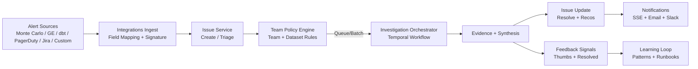
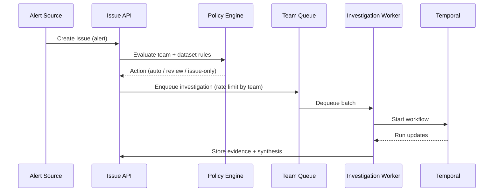

# Dataing 6-Month PMF + Series A Plan

## Goals
- Product market fit: teams use issues + investigations as the default data incident workflow.
- Enterprise readiness: OIDC + generic SAML, audit logs, and VPC/self-host packaging.
- Revenue: ARR growth with strong usage + retention in data platform teams.

## Success Metrics
- Activation: % of new orgs with first issue created and first investigation run within 7 days.
- Engagement: weekly active data teams, investigations per org per week, and issue resolution rate.
- Quality: % of investigations with accepted root cause and recommendations marked helpful.
- Revenue: pipeline to first enterprise customers + measurable ARR growth.

## UX (Aligned To Existing Frontend)

### Issues (Top-of-funnel Triage)
- Use existing list and workspace screens for triage, assignment, and investigation runs.
- Add team policy banner + link to Teams settings (policy editor lives in Settings > Teams).
- Show latest investigation summary on issue workspace when available.

References:
- `frontend/app/src/features/issues/IssueList.tsx`
- `frontend/app/src/features/issues/IssueWorkspace.tsx`
- `frontend/app/src/features/issues/IssueCreate.tsx`

### Investigations
- Keep current investigation detail layout (timeline, evidence, synthesis).
- Wire feedback UI into synthesis and evidence (thumbs up/down + reason).
- Support optional human-in-the-loop review UI when policies require it.

References:
- `frontend/app/src/features/investigation/InvestigationDetail.tsx`
- `frontend/app/src/features/investigation/components/InvestigationFeedbackButtons.tsx`
- `frontend/app/src/features/investigation/context-review.tsx`

### Notifications
- Keep current notifications page and route-to-resource behavior.
- Use approval_required notifications to route to context review.

References:
- `frontend/app/src/features/notifications/notifications-page.tsx`
- `frontend/app/src/features/notifications/components/notification-card.tsx`

### Team Policy Editor
- New editor in Settings > Teams to manage:
  - Alert sources per team
  - Auto-investigate thresholds
  - Human review requirements
  - Dataset-specific overrides (by dataset tag or explicit dataset)
  - Queue and rate limit settings

Reference:
- `frontend/app/src/features/settings/teams/teams-settings.tsx`


## Architecture

### System Flow


### Deployment + Enterprise Adapters
```mermaid
flowchart TB
    subgraph UI[Frontend]
        UI1[Issues]
        UI2[Investigations]
        UI3[Notifications]
        UI4[Settings / Teams]
    end

    subgraph API[Backend API]
        API1[Issue Service]
        API2[Policy Engine]
        API3[Investigation API]
        API4[Notifications]
        API5[Entitlements]
    end

    subgraph Core[Core Services]
        CORE1[Temporal Orchestrator]
        CORE2[Evidence Store]
        CORE3[Feedback Store]
    end

    subgraph Adapters[Adapters]
        AD1[Integrations
MC/GE/dbt/PD/Jira]
        AD2[SSO OIDC Adapter]
        AD3[SAML Adapter
(Generic)]
        AD4[Audit Log Adapter]
        AD5[Queue/Rate Limit
Redis]
    end

    UI --> API --> Core
    API --> Adapters
```

### Investigation Queueing



## APIs (New or Extended)

### Team Policies
- `GET /api/v1/teams/{id}/policies`
- `PUT /api/v1/teams/{id}/policies`
- `POST /api/v1/teams/{id}/policies/overrides`

Policy schema (high level):
- `sources[]` (mc, ge, dbt, pagerduty, jira, custom)
- `auto_investigate.min_severity`
- `review_required.max_severity`
- `queue.rate_limit_per_minute`
- `dataset_overrides[]` (dataset_id or tag-based)

### Issue Actions
- `POST /api/v1/issues/{id}/queue-investigation`
- `POST /api/v1/issues/{id}/require-review`
- `POST /api/v1/issues/{id}/resolve` (marks resolved = strong signal)

### Feedback
- `POST /api/v1/investigations/{id}/feedback`
- `GET /api/v1/investigations/{id}/feedback`

### Notifications
- `POST /api/v1/notifications/mark-all-read`
- `GET /api/v1/notifications?unread=true`

### Enterprise Auth
- `GET /api/v1/auth/sso/providers` (OIDC + SAML)
- `POST /api/v1/auth/sso/callback` (already for OIDC)
- SAML endpoints via adapter: `/api/v1/auth/sso/saml/*`


## Data Model (Additions)
- `team_policies` table
- `team_policy_overrides` table (dataset_id or tag)
- `team_queue_limits` table
- `issue_status_events` table (optional, for analytics)


## Roadmap (6 Months)

### Month 0-2: Triage + Policy Engine
- Implement team policy engine with dataset overrides and rate limits.
- Wire integrations into issues with policy-driven actions (auto, review, issue-only).
- Add policy editor in Settings > Teams.
- Replace in-memory SSE event storage and rate limiting with Redis.
- Tighten issue + investigation analytics (activation, weekly usage).

### Month 2-4: Investigation UX + Feedback Loop
- Wire feedback UI to investigation detail (synthesis and evidence).
- Add optional context review flow triggered by policy.
- Promote investigation summary on issue workspace.
- Improve recommendation capture and issue resolution signals.
- Stabilize queue worker and retry behavior.

### Month 4-6: Enterprise Readiness + VPC
- OIDC + generic SAML adapters (hexagonal provider interface).
- Audit log export and view.
- VPC/self-host deployment packaging and docs.
- Integration polish for Monte Carlo + Great Expectations.
- Runbook generation surfaced for resolved issues.

## Later Work
- SCIM provisioning (stub exists).
- Automated fixing based on validated user feedback.
- Compliance extensions beyond GDPR (finance/healthcare).
